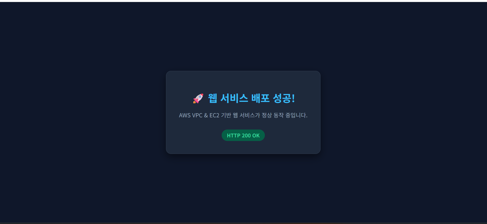

# codyssey_b3-01: 내가 만든 웹사이트를 인터넷에 올려 누구나 쓰게 하기

AWS VPC 기반으로 격리된 네트워크를 직접 설계하고, IAM 최소 권한 원칙을 적용하여 EC2 가상 서버에 Nginx 웹 서비스를 성공적으로 배포한 인프라 프로젝트입니다.

---

## 1. 웹 서비스 외부 접속 증빙 (과제 필수 제출물 2)

과제 요구사항에 따라 **방식 (A)**를 선택하여 외부 인터넷 환경(웹 브라우저)에서 서비스 접속을 검증하였습니다.

* **선택한 검증 방식**: **방식 (A) 웹 브라우저 접속**
* **접속 정보 (URL / IP)**: [http://3.36.130.0](http://3.36.130.0)
* **응답 결과**: HTTP 200 OK (배포 성공 페이지 정상 렌더링)

### 📸 외부 접속 결과 스크린샷

---

## 2. 인프라 아키텍처 및 구성 요약

* **리전 (Region)**: AWS 서울 리전 (`ap-northeast-2`)
* **VPC**: `codyssey-vpc` (IPv4 CIDR: `10.0.0.0/16`)
* **서브넷 (Public Subnet)**: `codyssey-public-subnet-2a` (`10.0.1.0/24`, AZ: `ap-northeast-2a`, 퍼블릭 IP 자동 할당)
* **인터넷 게이트웨이 (IGW)**: `codyssey-igw` (VPC 연결 완료)
* **라우팅 테이블 (Route Table)**: `codyssey-public-rt` (`0.0.0.0/0 -> codyssey-igw`, 퍼블릭 서브넷 연결)
* **보안 그룹 (Security Group)**: `codyssey-web-sg2`
  * HTTP (포트 80): `0.0.0.0/0` (인터넷 전체 웹 접속 허용)
  * SSH (포트 22): `<관리자 개인 IP>/32` (개인 IP 한정 원격 관리 접속)
* **컴퓨트 (EC2)**: `codyssey-web-server` (`t3.micro`, Ubuntu Server 24.04 LTS, Nginx 웹 서버 가동)

## 3. 요구사항별 세부 구현 및 검증 내역 (인프라 검증 증빙)

과제 요구사항 1번부터 6번까지의 인프라 요건을 빠짐없이 충족했음을 입증하기 위해, **어떤 엔지니어링 의도와 목적(Why)**을 가지고 확인하였으며 **어떤 콘솔 화면 및 터미널 결과(What)**를 캡처하여 증빙하였는지 기록하였습니다.

---

### 1. 네트워크 구성 증빙 (VPC, Subnet, IGW, Route Table)

#### 📸 [증빙 1-A] 라우팅 테이블 상세 및 서브넷 라우팅 경로
* **무엇을 보여주기 위한 것인가? (증빙 목적)**
  * 생성된 서브넷(`codyssey-public-subnet-2a`)이 격리된 VPC 내부 로컬 통신뿐만 아니라, 인터넷 게이트웨이(`codyssey-igw`)로 통하는 기본 라우팅(`0.0.0.0/0`)을 확보하여 외부 인터넷과 자유롭게 양방향 패킷을 교환할 수 있는 **완전한 퍼블릭 서브넷(Public Subnet)**으로 동작함을 증명하기 위함입니다.
* **무엇을 찍어 어떻게 증명하였는가? (증빙 내용 및 핵심 확인 요소)**
  * **확인 화면**: AWS 콘솔 > VPC > [라우팅 테이블] > `codyssey-public-rt` 상세 화면
  * **핵심 확인 포인트**:
    1. **식별 정보**: 라우팅 테이블 명칭이 `codyssey-public-rt`이며, 소속 VPC가 `codyssey-vpc`로 정확히 지정됨.
    2. **외부 라우팅 경로 (라우팅 탭)**: 기본 경로 `0.0.0.0/0`의 타깃이 인터넷 게이트웨이 `igw-02e4bfb71a8daf2ab`로 지정되어 초록색 [활성] 상태임.
    3. **서브넷 연결 상태 (명시적 서브넷 연결)**: `codyssey-public-subnet-2a` 서브넷이 이 라우팅 테이블에 명시적으로 바인딩되어 있음을 확인.

* **증빙 스크린샷**:
  * **(1) 인터넷 게이트웨이(IGW) 라우팅 경로 (`0.0.0.0/0 -> igw-02e4bfb71a8daf2ab`)**
  
  * **(2) 퍼블릭 서브넷 명시적 연결 표 (`codyssey-public-subnet-2a`)**
  

#### 📸 [증빙 1-B] 인스턴스 아웃바운드(Outbound) 인터넷 통신 검증
* **무엇을 보여주기 위한 것인가? (증빙 목적)**
  * 퍼블릭 서브넷에 배치된 EC2 가상 머신이 외부 인터넷망으로 나가는 아웃바운드 패킷을 정상 전달할 수 있어, 향후 OS 보안 패치, Nginx 패키지 다운로드(`apt update/install`), 외부 API 연동이 원활하게 수행됨을 증명하기 위함입니다.
* **무엇을 찍어 어떻게 증명하였는가? (증빙 내용 및 핵심 확인 요소)**
  * **확인 화면**: EC2 인스턴스 SSH 원격 접속 터미널
  * **실행 명령어**: `curl -I https://example.com`
  * **핵심 확인 포인트**: 외부 공용 웹 서버로부터 정상 HTTP 응답 코드(`HTTP/2 200` 또는 `HTTP/1.1 200 OK`)를 수신받은 화면을 캡처하여 아웃바운드 통신 성립을 증명함.

---

### 2. 컴퓨트 및 웹 서버 배포 증빙 (EC2 & Nginx)

#### 📸 [증빙 2-A] EC2 인스턴스 배치 및 가동 상태 (Running & 2/2 Passed)
* **무엇을 보여주기 위한 것인가? (증빙 목적)**
  * 가상 머신이 사전에 구성한 퍼블릭 서브넷(`codyssey-public-subnet-2a`)에 올바르게 프로비저닝되었고, AWS 시스템 및 인스턴스 하드웨어 검증을 모두 통과(`2/2 검사 통과`)하여 정상 가동 중이며, 외부에서 접근 가능한 고유 퍼블릭 IPv4를 보유하고 있음을 증명하기 위함입니다.
* **무엇을 찍어 어떻게 증명하였는가? (증빙 내용 및 핵심 확인 요소)**
  * **확인 화면**: AWS 콘솔 > EC2 > [인스턴스] > `codyssey-web-server` 상세 카드
  * **핵심 확인 포인트**:
    1. **인스턴스 상태**: 초록색 `실행 중 (running)` 및 상태 검사 `2/2 검사 통과` 표시 확인.
    2. **네트워크 정보**: 서브넷 ID가 `codyssey-public-subnet-2a`이고, 할당된 퍼블릭 IPv4 주소(`3.36.130.0`) 확인.
    3. **접속 자격 증명**: 지정한 키 페어(`codyssey-key`)가 바인딩되어 비인가자의 접속을 차단하고 있음을 확인.

#### 📸 [증빙 2-B] Nginx 웹 서버 데몬 활성화 및 로컬 루프백 응답
* **무엇을 보여주기 위한 것인가? (증빙 목적)**
  * 인스턴스 내부에서 Nginx 서비스가 백그라운드 데몬으로 상시 구동되고 있으며, 서버 자체 로컬 루프백(`localhost`) 요청에 대해 정상적으로 HTTP 200 코드 및 커스텀 헬스체크(`/health`) 응답을 안정적으로 반환하고 있음을 증명하기 위함입니다.
* **무엇을 찍어 어떻게 증명하였는가? (증빙 내용 및 핵심 확인 요소)**
  * **확인 화면**: EC2 SSH 원격 접속 터미널
  * **확인 명령어 및 포인트**:
    1. `sudo systemctl status nginx` $\to$ 초록색 `Active: active (running)` 상태 증명.
    2. `curl -I http://localhost` $\to$ 내부 응답 헤더 `HTTP/1.1 200 OK` 확인.
    3. `curl http://localhost/health` $\to$ 헬스체크 엔드포인트 응답 문자열 `OK` 확인.

* **증빙 스크린샷**:
  * **(1) Nginx 데몬 활성화 상태 (`Active: active (running)`)**
  
  * **(2) 서버 내부 80번 포트 루프백 응답 (`HTTP/1.1 200 OK`)**
  
  * **(3) 커스텀 헬스체크 엔드포인트 정상 응답 (`OK`)**
  

---

### 3. 접근 제어 증빙 (보안 그룹 최소 개방)

#### 📸 [증빙 3] 최소 포트 인바운드 보안 규칙 (HTTP:80 & SSH:22)
* **무엇을 보여주기 위한 것인가? (증빙 목적)**
  * 모든 포트를 열어두는 위험한 설정(`0-65535 전체 개방`)을 일절 배제하고, 서비스 제공에 필수적인 `HTTP (80)` 포트만 불특정 다수(`0.0.0.0/0`)에 오픈하며, 서버 관리를 위한 `SSH (22)` 포트는 오직 **관리자 개인 공인 IP(`/32`)**로만 철저히 한정하는 '최소 권한 네트워크 방화벽 원칙'을 준수했음을 증명하기 위함입니다.
* **무엇을 찍어 어떻게 증명하였는가? (증빙 내용 및 핵심 확인 요소)**
  * **확인 화면**: AWS 콘솔 > EC2 > [보안 그룹] > `codyssey-web-sg2` 상세 화면
  * **핵심 확인 포인트**:
    1. **보안 그룹 격리**: 해당 보안 그룹이 `codyssey-vpc`에 격리 소속되어 있음을 확인.
    2. **인바운드 규칙 제한**:
       * `HTTP` (포트 80) : 소스 `0.0.0.0/0` (웹 서비스 전 세계 공개)
       * `SSH` (포트 22) : 소스 `<관리자 공인 IP>/32` (관리자 1인 한정)
    3. **안전성 검증**: 불필요한 포트나 전체 트래픽 개방 규칙이 존재하지 않음을 단일 표로 입증.

---

### 4. 권한(IAM) 최소 권한 원칙 증빙

#### 📸 [증빙 4] IAM 작업 사용자 권한 및 AdministratorAccess 배제
* **무엇을 보여주기 위한 것인가? (증빙 목적)**
  * 보안상 매우 위험한 루트(Root) 계정 및 모든 권한을 가진 `AdministratorAccess` 기본 관리자 정책 사용을 배제하고, 실무 클라우드 거버넌스 규정에 따라 본 실습에 반드시 필요한 VPC/EC2 리소스 제어 권한만을 정밀하게 부여한 커스텀 고객 관리형 정책(`CodysseyB3LeastPrivilegePolicy`)만으로 인프라를 구축했음을 증명하기 위함입니다.
* **무엇을 찍어 어떻게 증명하였는가? (증빙 내용 및 핵심 확인 요소)**
  * **확인 화면**: AWS 콘솔 > IAM > [사용자] > `codyssey-b3-user` > [권한] 탭
  * **핵심 확인 포인트**:
    1. **사용자 식별**: 실습 전용 IAM 계정인 `codyssey-b3-user` 화면임을 확인.
    2. **관리자 권한 부재**: `AdministratorAccess` 같은 위험한 전권 관리자 정책이 일절 부여되어 있지 않음을 확인.
    3. **최소 권한 정책 구성**: 인프라 제어를 위해 직접 생성한 고객 관리형 정책인 `CodysseyB3LeastPrivilegePolicy`와 AWS 콘솔 비밀번호 자체 변경을 위한 기본 편의 정책인 `IAMUserChangePassword` 단 2개만 연결되어 있어 최소 권한 원칙을 완벽히 충족함.
    - `IAMUserChangePassword`: AWS에서 웹 콘솔에 로그인할 수 있는 사용자를 만들 때, "사용자가 본인의 로그인 비밀번호를 스스로 변경할 수 있도록" AWS가 기본적으로 연결해 주는 안전한 편의 정책입니다.

---

### 5. 외부 접속 최종 서비스 검증 (과제 필수 제출물 2)

#### 📸 [증빙 5] 공인 IP 기반 웹 브라우저 접속 화면
* **무엇을 보여주기 위한 것인가? (증빙 목적)**
  * 위에서 구성한 VPC, IGW, 라우팅 테이블, 보안 그룹, EC2, Nginx 등 모든 인프라 계층이 유기적으로 연동되어, 실제 최종 사용자가 인터넷 브라우저를 통해 배포된 웹 서비스에 아무런 장애 없이 성공적으로 접속할 수 있음을 최종 증명하기 위함입니다.
* **무엇을 찍어 어떻게 증명하였는가? (증빙 내용 및 핵심 확인 요소)**
  * **확인 화면**: 외부 클라이언트 웹 브라우저 (Chrome)
  * **접속 주소**: `http://3.36.130.0`
  * **핵심 확인 포인트**:
    * 주소창에 EC2 인스턴스의 퍼블릭 IP(`http://3.36.130.0`)가 명시됨.
    * 웹 페이지 본문에 "🚀 웹 서비스 배포 성공! HTTP 200 OK" 콘텐츠 카드가 에러(연결 지연, 502 Bad Gateway 등) 없이 깔끔하게 렌더링됨 (`docs/01_step5.png` 기재 완료).

---

### 6. 운영 안정성 및 과금 방지 증빙 (Clean-up & Cost Zero)

실습 완료 후 클라우드 인프라 자원을 안전하게 회수하고 불필요한 과금을 원천 차단하기 위해 체계적인 역종속성 순서에 따라 리소스를 정리하고 검증을 완료하였습니다. (공식 산출물: [`docs/cleanup-checklist.md`](./docs/cleanup-checklist.md))

#### 📋 리소스 정리 최종 점검 체크리스트

| 점검 대상 리소스 | 식별 정보 / 이름 | 정리 작업 내용 | 최종 상태 | 과금 위험 여부 |
| :--- | :--- | :--- | :---: | :---: |
| **EC2 인스턴스** | `i-04fc2f1d6f00e0475` / `codyssey-web-server` | 인스턴스 영구 종료 (`Terminate`) | `Terminated` | 없음 (0원) |
| **EBS 루트 볼륨** | 10GiB gp3 블록 스토리지 | `DeleteOnTermination` 옵션에 의한 자동 소멸 | **잔존 볼륨 0개** | 없음 (0원) |
| **탄력적 IP (EIP)** | 고정 공인 IP | 실습 중 미발급 (동적 공인 IP만 활용) | **할당 0개** | 없음 (0원) |
| **인터넷 게이트웨이** | `igw-02e4bfb71a8daf2ab` / `codyssey-igw` | VPC 연결 해제(`Detach`) 후 영구 삭제 | **삭제 완료** | 없음 (0원) |
| **서브넷 & 라우팅** | `codyssey-public-subnet-2a` / `codyssey-public-rt` | 서브넷 및 커스텀 라우팅 테이블 삭제 | **삭제 완료** | 없음 (0원) |
| **보안 그룹 (SG)** | `codyssey-web-sg`, `codyssey-web-sg2` | 실습용 보안 그룹 2종 삭제 | **삭제 완료** | 없음 (0원) |
| **가상 네트워크 (VPC)** | `vpc-039bf298cd5b870a5` / `codyssey-vpc` | 내부 리소스 완전 회수 후 VPC 최종 영구 삭제 | **삭제 완료** | 없음 (0원) |
| **고비용 관리형 서비스** | NAT Gateway, Load Balancer, RDS | 프리티어 유지를 위해 애초 미생성 | **0개 (미생성)** | 없음 (0원) |
| **AWS 결제(Billing)** | AWS Billing and Cost Management | 홈 대시보드 무료 플랜 요금 청구 없음 확인 | **청구 $0.00** | **과금 0원 확정** |

---

#### 📸 [증빙 6-A] 인터넷 게이트웨이(IGW) 분리 및 해제 완료
* **무엇을 보여주기 위한 것인가? (증빙 목적)**
  * VPC를 삭제하기 전, 외부 인터넷과 사유지(VPC)를 연결하던 인터넷 게이트웨이(`codyssey-igw`)를 VPC에서 안전하게 분리(`Detach`)하여 네트워크 종속성을 해제했음을 증명합니다.
* **무엇을 찍어 어떻게 증명하였는가? (증빙 내용 및 핵심 확인 요소)**
  * **확인 화면**: AWS 콘솔 > VPC > [인터넷 게이트웨이]
  * **핵심 확인 포인트**: 상단에 초록색 완료 배너(`인터넷 게이트웨이를 VPC에서 분리 완료 - igw-02e4bfb71a8daf2ab / codyssey-igw`)가 표시되고 상태가 **`Detached`**로 정상 변경되었음을 입증.

.png)

---

#### 📸 [증빙 6-B] EC2 종료 및 EBS 볼륨 자동 소멸 (잔존 볼륨 0개)
* **무엇을 보여주기 위한 것인가? (증빙 목적)**
  * EC2 가상 머신 종료 후 가장 흔하게 과금을 유발하는 요인인 **EBS(하드디스크 볼륨)**가 `DeleteOnTermination: true` 속성에 의해 완전히 소멸되어, 계정에 유휴 볼륨이 단 1개도 남아있지 않음을 증명합니다.
* **무엇을 찍어 어떻게 증명하였는가? (증빙 내용 및 핵심 확인 요소)**
  * **확인 화면**: AWS 콘솔 > EC2 > [Elastic Block Store] > [볼륨]
  * **핵심 확인 포인트**: 볼륨 목록 테이블에 **`현재 이 리전에 볼륨이 없습니다.`** 문구가 출력되어 보관료 과금 대상이 0건임을 입증.

.png)

---

#### 📸 [증빙 6-C] VPC (`codyssey-vpc`) 최종 영구 삭제 완료
* **무엇을 보여주기 위한 것인가? (증빙 목적)**
  * EC2, 서브넷, 라우팅 테이블, 보안 그룹, 인터넷 게이트웨이 등 모든 하위 종속 리소스가 완벽히 정리된 후, 인프라의 바탕이 되었던 사유지 네트워크 VPC가 아무런 에러(`DependencyViolation`) 없이 완전히 삭제되었음을 증명합니다.
* **무엇을 찍어 어떻게 증명하였는가? (증빙 내용 및 핵심 확인 요소)**
  * **확인 화면**: AWS 콘솔 > VPC > [VPC] 목록
  * **핵심 확인 포인트**: 상단에 초록색 완료 배너(`vpc-039bf298cd5b870a5 / codyssey-vpc을(를) 삭제했습니다.`)가 표시되고, 목록에 AWS 기본 VPC(`Default VPC`) 1개만 남아 실습용 사유지가 완전히 소멸되었음을 입증.

.png)

---

#### 📸 [증빙 6-D] IAM 최소 권한 사용자 접근 제어 및 보안 상태
* **무엇을 보여주기 위한 것인가? (증빙 목적)**
  * 실습 작업을 수행한 IAM 사용자(`codyssey-b3-user`)가 최소 권한 원칙에 따라 EC2/VPC 제어 권한만을 부여받았음을 재확인하고, 무단 결제/청구서 변경 권한이 원천 분리되어 있음을 증명합니다.
* **무엇을 찍어 어떻게 증명하였는가? (증빙 내용 및 핵심 확인 요소)**
  * **확인 화면**: AWS 콘솔 > IAM > [사용자] 상세 화면
  * **핵심 확인 포인트**: 계정 ID `388094502979`의 `codyssey-b3-user`로 접속하여 안전하게 작업을 완료하였음을 확인.

.png)

---

#### 📸 [증빙 6-E] AWS 결제 및 비용 관리(Billing) 대시보드 확인
* **무엇을 보여주기 위한 것인가? (증빙 목적)**
  * 실습 종료 후 AWS 공식 결제 및 비용 관리 대시보드를 통해 불필요한 유료 서비스가 청구되지 않고 무료 플랜 한도 내에서 100% 안전하게 마무리되었음을 최종 증명합니다.
* **무엇을 찍어 어떻게 증명하였는가? (증빙 내용 및 핵심 확인 요소)**
  * **확인 화면**: AWS 콘솔 > Billing and Cost Management > [과금 정보 및 비용 관리 홈]
  * **핵심 확인 포인트**: 상단 공식 배너에 **`무료 플랜 계정에는 요금이 청구되지 않습니다.`**가 명시되어 있어 최종 과금액이 **`$0.00`**임을 확인.

.png)