# codyssey_b3-01: 내가 만든 웹사이트를 인터넷에 올려 누구나 쓰게 하기

AWS VPC 기반으로 격리된 네트워크를 직접 설계하고, IAM 최소 권한 원칙을 적용하여 EC2 가상 서버에 Nginx 웹 서비스를 성공적으로 배포한 인프라 프로젝트입니다.

---

## 1. 웹 서비스 외부 접속 증빙 (과제 필수 제출물 2)

과제 요구사항에 따라 **방식 (A)**를 선택하여 외부 인터넷 환경(웹 브라우저)에서 서비스 접속을 검증하였습니다.

* **선택한 검증 방식**: **방식 (A) 웹 브라우저 접속**
* **접속 정보 (URL / IP)**: [http://3.36.130.0](http://3.36.130.0)
* **응답 결과**: HTTP 200 OK (배포 성공 페이지 정상 렌더링)

### 📸 외부 접속 결과 스크린샷
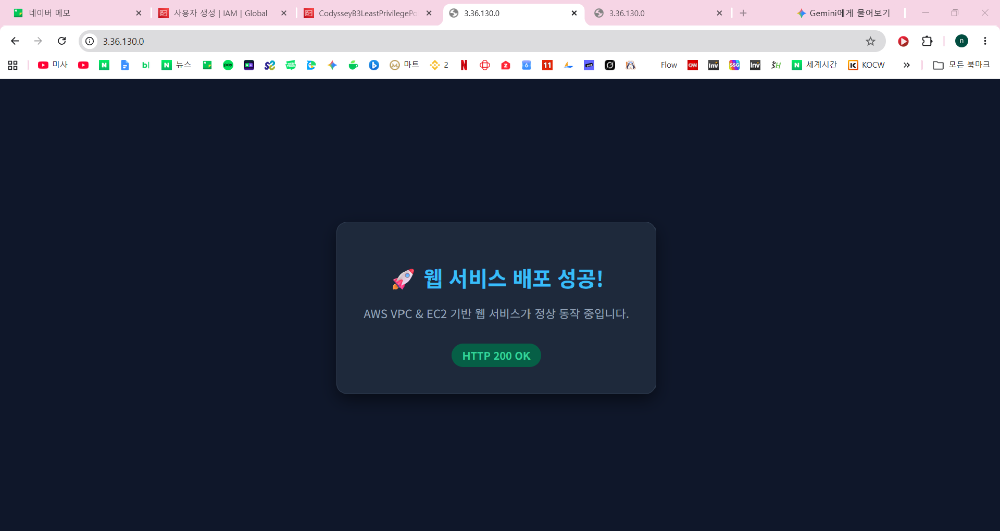
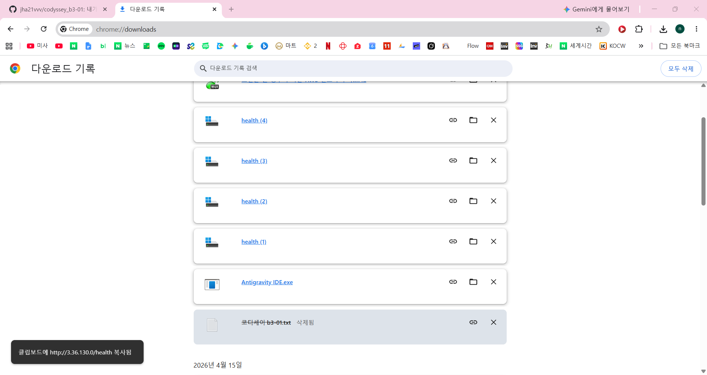
---

## 2. 인프라 아키텍처 및 구성 요약

* **리전 (Region)**: AWS 서울 리전 (`ap-northeast-2`)
* **VPC**: `codyssey-vpc` (IPv4 CIDR: `10.0.0.0/16`)
* **서브넷 (Public Subnet)**: `codyssey-public-subnet-2a` (`10.0.1.0/24`, AZ: `ap-northeast-2a`, 퍼블릭 IP 자동 할당)
* **인터넷 게이트웨이 (IGW)**: `codyssey-igw` (VPC 연결 완료)
* **라우팅 테이블 (Route Table)**: `codyssey-public-rt` (`0.0.0.0/0 -> codyssey-igw`, 퍼블릭 서브넷 연결)
* **보안 그룹 (Security Group)**: `codyssey-web-sg2`
  * HTTP (포트 80): `0.0.0.0/0` (인터넷 전체 웹 접속 허용)
  * SSH (포트 22): `<관리자 개인 IP>/32` (개인 IP 한정 원격 관리 접속)
* **컴퓨트 (EC2)**: `codyssey-web-server` (`t3.micro`, Ubuntu Server 24.04 LTS, Nginx 웹 서버 가동)


## 3. 요구사항별 세부 구현 및 검증 내역 (인프라 검증 증빙)

과제 요구사항 1번부터 6번까지의 인프라 요건을 빠짐없이 충족했음을 입증하기 위해, **어떤 엔지니어링 의도와 목적(Why)**을 가지고 확인하였으며 **어떤 콘솔 화면 및 터미널 결과(What)**를 캡처하여 증빙하였는지 기록하였습니다.

---

### 1. 네트워크 구성 증빙 (VPC, Subnet, IGW, Route Table)

#### 📸 [증빙 1-A] 라우팅 테이블 상세 및 서브넷 라우팅 경로
* **무엇을 보여주기 위한 것인가? (증빙 목적)**
  * 생성된 서브넷(`codyssey-public-subnet-2a`)이 격리된 VPC 내부 로컬 통신뿐만 아니라, 인터넷 게이트웨이(`codyssey-igw`)로 통하는 기본 라우팅(`0.0.0.0/0`)을 확보하여 외부 인터넷과 자유롭게 양방향 패킷을 교환할 수 있는 **완전한 퍼블릭 서브넷(Public Subnet)**으로 동작함을 증명하기 위함입니다.
* **무엇을 찍어 어떻게 증명하였는가? (증빙 내용 및 핵심 확인 요소)**
  * **확인 화면**: AWS 콘솔 > VPC > [라우팅 테이블] > `codyssey-public-rt` 상세 화면
  * **핵심 확인 포인트**:
    1. **식별 정보**: 라우팅 테이블 명칭이 `codyssey-public-rt`이며, 소속 VPC가 `codyssey-vpc`로 정확히 지정됨.
    2. **외부 라우팅 경로 (라우팅 탭)**: 기본 경로 `0.0.0.0/0`의 타깃이 인터넷 게이트웨이 `igw-02e4bfb71a8daf2ab`로 지정되어 초록색 [활성] 상태임.
    3. **서브넷 연결 상태 (명시적 서브넷 연결)**: `codyssey-public-subnet-2a` 서브넷이 이 라우팅 테이블에 명시적으로 바인딩되어 있음을 확인.

* **증빙 스크린샷**:
  * **(1) 인터넷 게이트웨이(IGW) 라우팅 경로 (`0.0.0.0/0 -> igw-02e4bfb71a8daf2ab`)**
  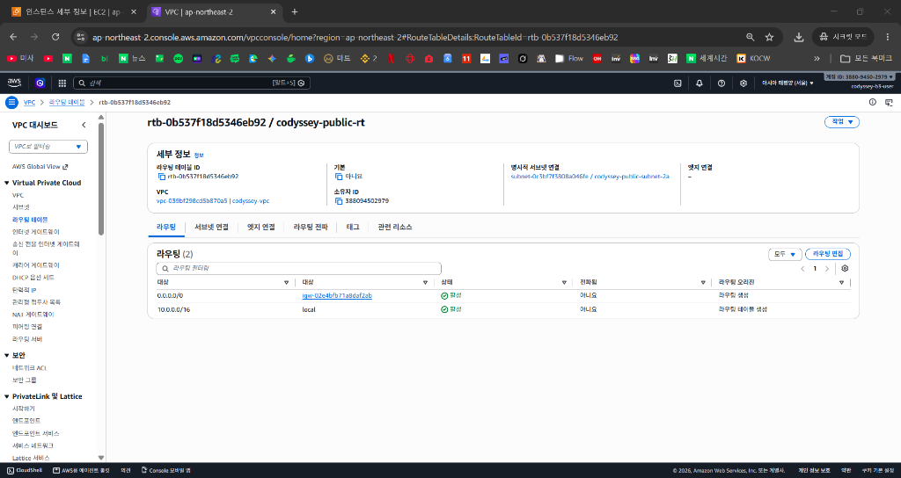
  * **(2) 퍼블릭 서브넷 명시적 연결 표 (`codyssey-public-subnet-2a`)**
  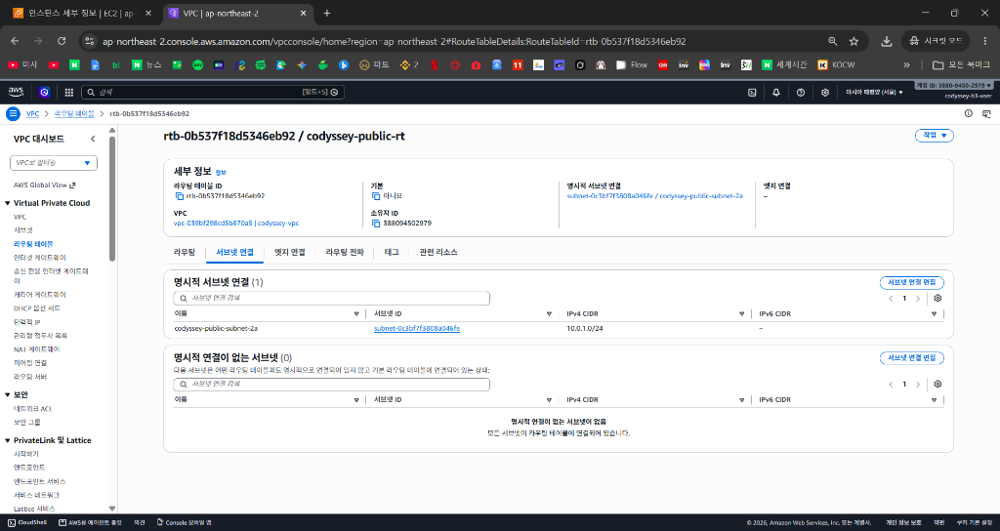

#### 📸 [증빙 1-B] 인스턴스 아웃바운드(Outbound) 인터넷 통신 검증
* **무엇을 보여주기 위한 것인가? (증빙 목적)**
  * 퍼블릭 서브넷에 배치된 EC2 가상 머신이 외부 인터넷망으로 나가는 아웃바운드 패킷을 정상 전달할 수 있어, 향후 OS 보안 패치, Nginx 패키지 다운로드(`apt update/install`), 외부 API 연동이 원활하게 수행됨을 증명하기 위함입니다.
* **무엇을 찍어 어떻게 증명하였는가? (증빙 내용 및 핵심 확인 요소)**
  * **확인 화면**: EC2 인스턴스 SSH 원격 접속 터미널
  * **실행 명령어**: `curl -I https://example.com`
  * **핵심 확인 포인트**: 외부 공용 웹 서버로부터 정상 HTTP 응답 코드(`HTTP/2 200` 또는 `HTTP/1.1 200 OK`)를 수신받은 화면을 캡처하여 아웃바운드 통신 성립을 증명함.

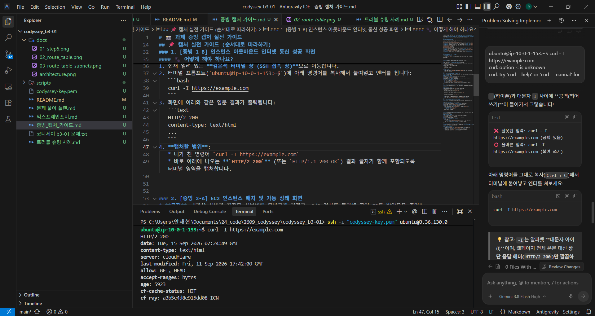

---

### 2. 컴퓨트 및 웹 서버 배포 증빙 (EC2 & Nginx)

#### 📸 [증빙 2-A] EC2 인스턴스 배치 및 가동 상태 (Running & 2/2 Passed)
* **무엇을 보여주기 위한 것인가? (증빙 목적)**
  * 가상 머신이 사전에 구성한 퍼블릭 서브넷(`codyssey-public-subnet-2a`)에 올바르게 잘ㅜ 생성되었고, AWS 시스템 및 인스턴스 하드웨어 검증을 모두 통과(`2/2 검사 통과`)하여 정상 가동 중이며, 외부에서 접근 가능한 고유 퍼블릭 IPv4를 보유하고 있음을 증명하기 위함입니다.
* **무엇을 찍어 어떻게 증명하였는가? (증빙 내용 및 핵심 확인 요소)**
  * **확인 화면**: AWS 콘솔 > EC2 > [인스턴스] > `codyssey-web-server` 상세 카드
  * **핵심 확인 포인트**:
    1. **인스턴스 상태**: 초록색 `실행 중 (running)` 및 상태 검사 `2/2 검사 통과` 표시 확인.
    2. **네트워크 정보**: 서브넷 ID가 `codyssey-public-subnet-2a`이고, 할당된 퍼블릭 IPv4 주소(`3.36.130.0`) 확인.
    3. **접속 자격 증명**: 지정한 키 페어(`codyssey-key`)가 바인딩되어 비인가자의 접속을 차단하고 있음을 확인.

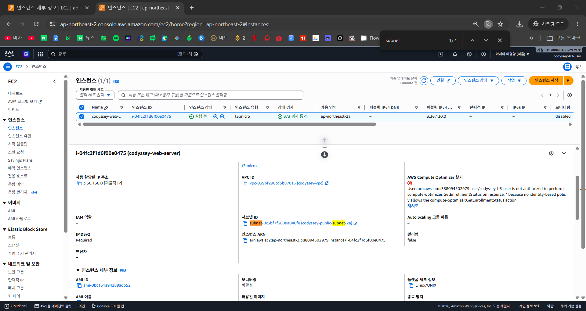

#### 📸 [증빙 2-B] Nginx 웹 서버 데몬 활성화 및 로컬 루프백 응답
* **무엇을 보여주기 위한 것인가? (증빙 목적)**
  * 인스턴스 내부에서 Nginx 서비스가 백그라운드 데몬(서비스 이름)으로 상시 구동되고 있으며, 서버 자체 로컬 루프백(`localhost`) 요청(컴퓨터가 자기 자신에게 보내는 요청을 작동확인용)에 대해 정상적으로 HTTP 200 코드 및 커스텀 헬스체크(`/health`) 응답을 안정적으로 반환하고 있음을 증명하기 위함입니다.
* **무엇을 찍어 어떻게 증명하였는가? (증빙 내용 및 핵심 확인 요소)**
  * **확인 화면**: EC2 SSH 원격 접속 터미널
  * **확인 명령어 및 포인트**:
    1. `sudo systemctl status nginx` $\to$ 초록색 `Active: active (running)` 상태 증명.
    2. `curl -I http://localhost` $\to$ 내부 응답 헤더 `HTTP/1.1 200 OK` 확인.
    3. `curl http://localhost/health` $\to$ 헬스체크 엔드포인트 응답 문자열 `OK` 확인.

* **증빙 스크린샷**:
  * **(1) Nginx 데몬 활성화 상태 (`Active: active (running)`)**
  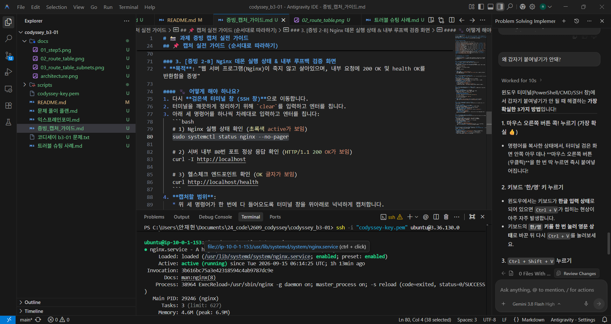
  * **(2) 서버 내부 80번 포트 루프백 응답 (`HTTP/1.1 200 OK`)**
  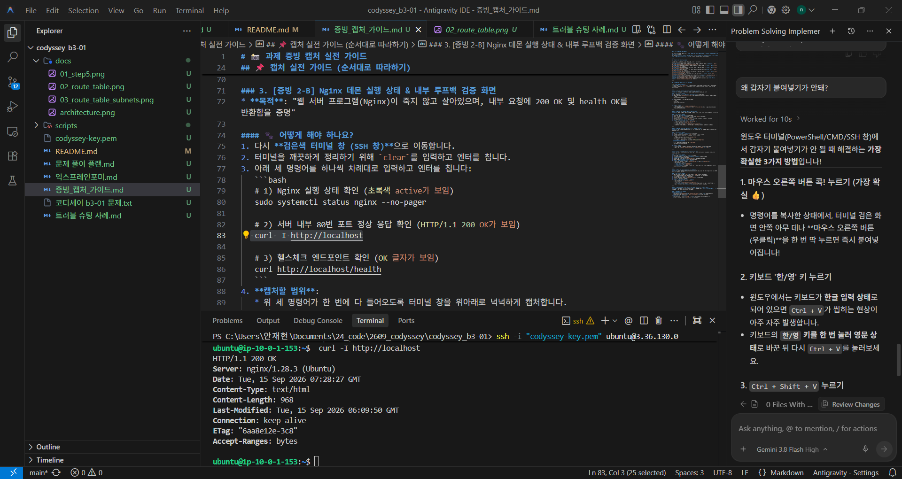
  * **(3) 커스텀 헬스체크 엔드포인트 정상 응답 (`OK`)**
  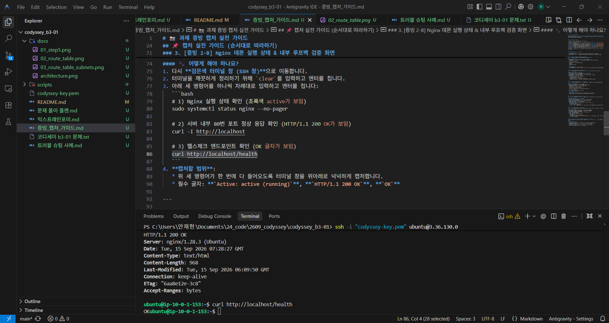

---

### 3. 접근 제어 증빙 (보안 그룹 최소 개방)

#### 📸 [증빙 3] 최소 포트 인바운드 보안 규칙 (HTTP:80 & SSH:22)
* **무엇을 보여주기 위한 것인가? (증빙 목적)**
  * 모든 포트를 열어두는 위험한 설정(`0-65535 전체 개방`)을 일절 배제하고, 서비스 제공에 필수적인 `HTTP (80)` 포트만 불특정 다수(`0.0.0.0/0`)에 오픈하며, 서버 관리를 위한 `SSH (22)` 포트는 오직 **관리자 개인 공인 IP(`/32`)**로만 철저히 한정하는 '최소 권한 네트워크 방화벽 원칙'을 준수했음을 증명하기 위함입니다.
* **무엇을 찍어 어떻게 증명하였는가? (증빙 내용 및 핵심 확인 요소)**
  * **확인 화면**: AWS 콘솔 > EC2 > [보안 그룹] > `codyssey-web-sg2` 상세 화면
  * **핵심 확인 포인트**:
    1. **보안 그룹 격리**: 해당 보안 그룹이 `codyssey-vpc`에 격리 소속되어 있음을 확인.
    2. **인바운드 규칙 제한**:
       * `HTTP` (포트 80) : 소스 `0.0.0.0/0` (웹 서비스 전 세계 공개)
       * `SSH` (포트 22) : 소스 `<관리자 공인 IP>/32` (관리자 1인 한정)
    3. **안전성 검증**: 불필요한 포트나 전체 트래픽 개방 규칙이 존재하지 않음을 단일 표로 입증.

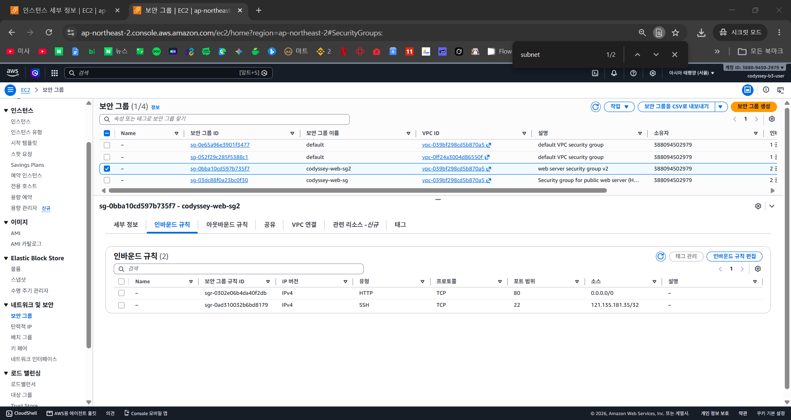

---

### 4. 권한(IAM) 최소 권한 원칙 증빙

#### 📸 [증빙 4] IAM 작업 사용자 권한 및 AdministratorAccess 배제
* **무엇을 보여주기 위한 것인가? (증빙 목적)**
  * 보안상 매우 위험한 루트(Root) 계정 및 모든 권한을 가진 `AdministratorAccess` 기본 관리자 정책 사용을 배제하고, 실무 클라우드 거버넌스 규정에 따라 본 실습에 반드시 필요한 VPC/EC2 리소스 제어 권한만을 정밀하게 부여한 커스텀 고객 관리형 정책(`CodysseyB3LeastPrivilegePolicy`)만으로 인프라를 구축했음을 증명하기 위함입니다.
* **무엇을 찍어 어떻게 증명하였는가? (증빙 내용 및 핵심 확인 요소)**
  * **확인 화면**: AWS 콘솔 > IAM > [사용자] > `codyssey-b3-user` > [권한] 탭
  * **핵심 확인 포인트**:
    1. **사용자 식별**: 실습 전용 IAM 계정인 `codyssey-b3-user` 화면임을 확인.
    2. **관리자 권한 부재**: `AdministratorAccess` 같은 위험한 전권 관리자 정책이 일절 부여되어 있지 않음을 확인.
    3. **최소 권한 정책 구성**: 인프라 제어를 위해 직접 생성한 고객 관리형 정책인 `CodysseyB3LeastPrivilegePolicy`와 AWS 콘솔 비밀번호 자체 변경을 위한 기본 편의 정책인 `IAMUserChangePassword` 단 2개만 연결되어 있어 최소 권한 원칙을 완벽히 충족함.
    - `IAMUserChangePassword`: AWS에서 웹 콘솔에 로그인할 수 있는 사용자를 만들 때, "사용자가 본인의 로그인 비밀번호를 스스로 변경할 수 있도록" AWS가 기본적으로 연결해 주는 안전한 편의 정책입니다.

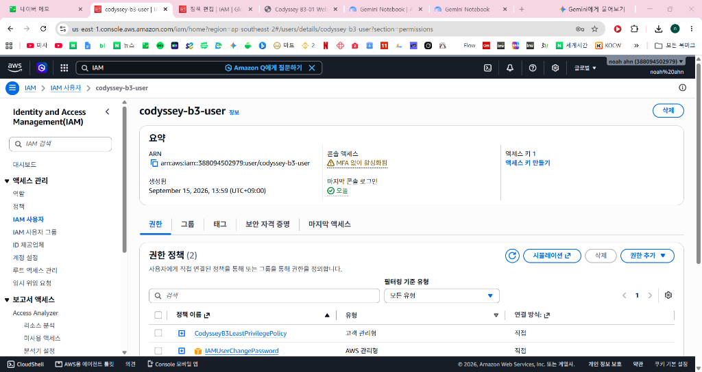

---

### 5. 외부 접속 최종 서비스 검증 (과제 필수 제출물 2)

#### 📸 [증빙 5] 공인 IP 기반 웹 브라우저 접속 화면
* **무엇을 보여주기 위한 것인가? (증빙 목적)**
  * 위에서 구성한 VPC, IGW, 라우팅 테이블, 보안 그룹, EC2, Nginx 등 모든 인프라 계층이 유기적으로 연동되어, 실제 최종 사용자가 인터넷 브라우저를 통해 배포된 웹 서비스에 아무런 장애 없이 성공적으로 접속할 수 있음을 최종 증명하기 위함입니다.
* **무엇을 찍어 어떻게 증명하였는가? (증빙 내용 및 핵심 확인 요소)**
  * **확인 화면**: 외부 클라이언트 웹 브라우저 (Chrome)
  * **접속 주소**: `http://3.36.130.0`
  * **핵심 확인 포인트**:
    * 주소창에 EC2 인스턴스의 퍼블릭 IP(`http://3.36.130.0`)가 명시됨.
    * 웹 페이지 본문에 "🚀 웹 서비스 배포 성공! HTTP 200 OK" 콘텐츠 카드가 에러(연결 지연, 502 Bad Gateway 등) 없이 깔끔하게 렌더링됨 (`docs/01_step5.png` 기재 완료).


---

### 6. 운영 안정성 및 과금 방지 증빙 (Clean-up & Cost Zero)

실습 완료 후 클라우드 인프라 자원을 안전하게 회수하고 불필요한 과금을 원천 차단하기 위해 체계적인 역종속성 순서에 따라 리소스를 정리하고 검증을 완료하였습니다. (공식 산출물: [`docs/cleanup-checklist.md`](./docs/cleanup-checklist.md))

#### 📋 리소스 정리 최종 점검 체크리스트

| 점검 대상 리소스 | 식별 정보 / 이름 | 정리 작업 내용 | 최종 상태 | 과금 위험 여부 |
| :--- | :--- | :--- | :---: | :---: |
| **EC2 인스턴스** | `i-04fc2f1d6f00e0475` / `codyssey-web-server` | 인스턴스 영구 종료 (`Terminate`) | `Terminated` | 없음 (0원) |
| **EBS 루트 볼륨** | 10GiB gp3 블록 스토리지 | `DeleteOnTermination` 옵션에 의한 자동 소멸 | **잔존 볼륨 0개** | 없음 (0원) |
| **탄력적 IP (EIP)** | 고정 공인 IP | 실습 중 미발급 (동적 공인 IP만 활용) | **할당 0개** | 없음 (0원) |
| **인터넷 게이트웨이** | `igw-02e4bfb71a8daf2ab` / `codyssey-igw` | VPC 연결 해제(`Detach`) 후 영구 삭제 | **삭제 완료** | 없음 (0원) |
| **서브넷 & 라우팅** | `codyssey-public-subnet-2a` / `codyssey-public-rt` | 서브넷 및 커스텀 라우팅 테이블 삭제 | **삭제 완료** | 없음 (0원) |
| **보안 그룹 (SG)** | `codyssey-web-sg`, `codyssey-web-sg2` | 실습용 보안 그룹 2종 삭제 | **삭제 완료** | 없음 (0원) |
| **가상 네트워크 (VPC)** | `vpc-039bf298cd5b870a5` / `codyssey-vpc` | 내부 리소스 완전 회수 후 VPC 최종 영구 삭제 | **삭제 완료** | 없음 (0원) |
| **고비용 관리형 서비스** | NAT Gateway, Load Balancer, RDS | 프리티어 유지를 위해 애초 미생성 | **0개 (미생성)** | 없음 (0원) |
| **AWS 결제(Billing)** | AWS Billing and Cost Management | 홈 대시보드 무료 플랜 요금 청구 없음 확인 | **청구 $0.00** | **과금 0원 확정** |

---

#### 📸 [증빙 6-B] EC2 종료 및 EBS 볼륨 자동 소멸 (잔존 볼륨 0개)
* **무엇을 보여주기 위한 것인가? (증빙 목적)**
  * EC2 가상 머신 종료 후 가장 흔하게 과금을 유발하는 요인인 **EBS(하드디스크 볼륨)**가 `DeleteOnTermination: true` 속성에 의해 완전히 소멸되어, 계정에 유휴 볼륨이 단 1개도 남아있지 않음을 증명합니다.
* **무엇을 찍어 어떻게 증명하였는가? (증빙 내용 및 핵심 확인 요소)**
  * **확인 화면**: AWS 콘솔 > EC2 > [Elastic Block Store] > [볼륨]
  * **핵심 확인 포인트**: 볼륨 목록 테이블에 **`현재 이 리전에 볼륨이 없습니다.`** 문구가 출력되어 보관료 과금 대상이 0건임을 입증.
_1.png)
.png)
---
- EIP(탄력적 IP) 미할당 확인

_1.png)
---

---
#### 📸 [증빙 6-A] 인터넷 게이트웨이(IGW) 분리 및 해제 완료
* **무엇을 보여주기 위한 것인가? (증빙 목적)**
  * VPC를 삭제하기 전, 외부 인터넷과 사유지(VPC)를 연결하던 인터넷 게이트웨이(`codyssey-igw`)를 VPC에서 안전하게 분리(`Detach`)하여 네트워크 종속성을 해제했음을 증명합니다.
* **무엇을 찍어 어떻게 증명하였는가? (증빙 내용 및 핵심 확인 요소)**
  * **확인 화면**: AWS 콘솔 > VPC > [인터넷 게이트웨이]
  * **핵심 확인 포인트**: 상단에 초록색 완료 배너(`인터넷 게이트웨이를 VPC에서 분리 완료 - igw-02e4bfb71a8daf2ab / codyssey-igw`)가 표시되고 상태가 **`Detached`**로 정상 변경되었음을 입증.

.png)

---
- 5. 라우팅/서브넷 삭제
- 6. 보안 그룹 삭제

#### 📸 [증빙 6-C] VPC (`codyssey-vpc`) 최종 영구 삭제 완료
* **무엇을 보여주기 위한 것인가? (증빙 목적)**
  * EC2, 서브넷, 라우팅 테이블, 보안 그룹, 인터넷 게이트웨이 등 모든 하위 종속 리소스가 완벽히 정리된 후, 인프라의 바탕이 되었던 사유지 네트워크 VPC가 아무런 에러(`DependencyViolation`) 없이 완전히 삭제되었음을 증명합니다.
* **무엇을 찍어 어떻게 증명하였는가? (증빙 내용 및 핵심 확인 요소)**
  * **확인 화면**: AWS 콘솔 > VPC > [VPC] 목록
  * **핵심 확인 포인트**: 상단에 초록색 완료 배너(`vpc-039bf298cd5b870a5 / codyssey-vpc을(를) 삭제했습니다.`)가 표시되고, 목록에 AWS 기본 VPC(`Default VPC`) 1개만 남아 실습용 사유지가 완전히 소멸되었음을 입증.

.png)

---

#### 📸 [증빙 6-E] AWS 결제 및 비용 관리(Billing) 대시보드 확인
* **무엇을 보여주기 위한 것인가? (증빙 목적)**
  * 실습 종료 후 AWS 공식 결제 및 비용 관리 대시보드를 통해 불필요한 유료 서비스가 청구되지 않고 무료 플랜 한도 내에서 100% 안전하게 마무리되었음을 최종 증명합니다.
* **무엇을 찍어 어떻게 증명하였는가? (증빙 내용 및 핵심 확인 요소)**
  * **확인 화면**: AWS 콘솔 > Billing and Cost Management > [과금 정보 및 비용 관리 홈]
  * **핵심 확인 포인트**: 상단 공식 배너에 **`무료 플랜 계정에는 요금이 청구되지 않습니다.`**가 명시되어 있어 최종 과금액이 **`$0.00`**임을 확인.

.png)

### 학습목표 기반 질의 응답
# 1. VPC, Subnet, Route Table, Internet Gateway가 각각 어떤 역할을 하며 트래픽 흐름이 어떻게 이어지는지 말로 설명할 수 있다.
- **핵심 요소별 역할**
  - **VPC (Virtual Private Cloud)**: AWS 클라우드 내에 논리적으로 격리된 사용자 전용의 가상 사설 네트워크 공간입니다. (비유: 나만의 독립된 아파트 단지)
  - **Subnet (서브넷)**: 하나의 VPC를 IP 대역별로 쪼갠 세부 네트워크 구역입니다. 외부 인터넷과 통신 가능 여부에 따라 퍼블릭(Public)과 프라이빗(Private)으로 분리하여 보안과 관리를 용이하게 합니다. (비유: 단지 내 101동, 102동 등 용도별 건물)
  - **Internet Gateway (IGW, 인터넷 게이트웨이)**: VPC 내부와 외부 인터넷 간의 양방향 통신을 가능하게 해주는 통로이자 관문입니다. (비유: 아파트 단지의 정문 출입구)
  - **Route Table (라우팅 테이블)**: 서브넷이나 게이트웨이의 네트워크 트래픽이 어디로 향해야 하는지(목적지 CIDR와 타깃) 경로를 지정하는 이정표/규칙 목록입니다. (비유: 단지 내 내비게이션/도로 이정표)

- **트래픽 흐름 (Traffic Flow)**
  - **외부 사용자가 EC2 웹 서버에 접속할 때 (인바운드 흐름)**:
    1. `외부 사용자 브라우저`에서 EC2의 퍼블릭 IP로 접속 요청 전송
    2. VPC의 유일한 외부 관문인 `Internet Gateway(IGW)`에 도달
    3. IGW를 통과해 `VPC` 내부로 진입
    4. VPC 내 `Route Table`의 경로 안내를 통해 목적지 IP가 있는 `Public Subnet`으로 이동
    5. 서브넷 내 실행 중인 `EC2 웹 서버(Nginx)`에 최종 도달 (보안 그룹 80번 포트 검증 후 응답)
  - **EC2 웹 서버가 외부 인터넷으로 나갈 때 (아웃바운드 흐름)**:
    1. `EC2 인스턴스`에서 외부 패킷 전송 (예: 패키지 다운로드 또는 사용자 응답)
    2. 서브넷에 연결된 `Route Table` 확인 ➡️ 기본 경로인 `0.0.0.0/0`의 타깃이 `igw-xxxx`로 지정되어 있는지 판별
    3. 타깃으로 지정된 `Internet Gateway(IGW)`를 통과하여 외부 인터넷으로 안전하게 전달

# 2. Security Group과 IAM의 역할 차이를 구분할 수 있고, 최소 권한 원칙을 왜/어떻게 적용하는지 설명할 수 있다.
- **역할 차이 (네트워크 제어 vs 리소스 조작 권한)**
  - **Security Group (네트워크 레벨 방화벽)**: 패킷 단위의 트래픽을 제어합니다. "어떤 IP가 몇 번 포트(Port, 예: 80, 22)로 통신할 수 있는가?"를 검사하는 가상 방화벽입니다.
  - **IAM (리소스/API 레벨 인증·인가)**: 사람이나 서비스의 조작 권한을 제어합니다. "누가(User/Role) 어떤 AWS 리소스에 대해 무슨 작업(Action, 예: EC2 생성/삭제, S3 조회)을 할 수 있는가?"를 통제합니다.
  - *비유: Security Group이 건물 입구의 '차단기/검문소'라면, IAM은 직원 각자가 가진 '사원증의 부서별 출입 권한'입니다.*

- **최소 권한 원칙 (Principle of Least Privilege)**
  - **왜(Why) 필요한가?**: 보안 사고(키 유출, 해킹)나 관리자의 단순 실수(오작동) 발생 시, 피해가 전체 시스템으로 번지는 것을 막고 **피해 범위(Blast Radius, 폭발 반경)를 최소화**하기 위해 적용합니다.
  - **어떻게(How) 적용하는가?**:
    - **보안 그룹**: 모든 포트를 다 열지 않고 꼭 필요한 포트(웹: 80/443)만 열며, 관리자 포트(SSH 22)는 전체 개방(`0.0.0.0/0`)이 아닌 특정 관리자 IP만 지정합니다. (기본 차단 / 화이트리스트 방식)
    - **IAM**: 루트(Root) 계정 사용을 금지하고, 모든 권한(`AdministratorAccess`) 대신 특정 리소스(ARN)와 특정 작업(예: `s3:GetObject`)만 명시된 정책(Policy)을 부여합니다. 또한 서버에는 비밀키를 하드코딩하지 않고 IAM 역할(Role)을 부여합니다.

# 3. 외부 요청이 EC2의 웹 서버까지 도달하기 위해 필요한 설정(라우팅/퍼블릭 IP/보안그룹)을 논리적으로 설명할 수 있다.
- **필수 설정 4가지의 논리적 역할**
  1. **퍼블릭 IP (Public IPv4)**: 외부 인터넷에서 내 EC2 인스턴스를 식별하고 찾아올 수 있는 고유한 공인 주소 역할을 합니다. (내부 사설 IP만으로는 외부에서 직접 찾아올 수 없음)
  2. **인터넷 게이트웨이 (Internet Gateway)**: VPC라는 사설 네트워크와 공용 인터넷 세상을 연결해 주는 유일한 출입 통로(관문)입니다.
  3. **라우팅 테이블 (Route Table) 경로 설정**: 서브넷의 라우팅 테이블에 외부 인터넷 전체(`0.0.0.0/0`)로 나가는 트래픽의 타깃(Target)이 인터넷 게이트웨이(`igw-xxxx`)로 지정되어 있어야만 양방향 패킷이 오갈 수 있습니다.
  4. **보안 그룹 (Security Group) 인바운드 규칙**: 서버 앞의 가상 방화벽으로, 웹 서비스 포트인 **HTTP(TCP 80)를 `0.0.0.0/0`에 대해 명시적으로 허용**해야만 패킷이 차단되지 않고 인스턴스에 도달합니다.

- **외부 요청의 논리적 도달 흐름 (End-to-End)**
  `[외부 사용자 브라우저]` ➡️ **① 퍼블릭 IP**를 목적지로 패킷 전송 ➡️ **② 인터넷 게이트웨이(IGW)** 통과하여 VPC 진입 ➡️ **③ 라우팅 테이블**의 안내를 받아 해당 Public Subnet으로 전달 ➡️ **④ 보안 그룹**이 80번 포트 검사 후 통과 ➡️ **`[EC2 내부 Nginx 웹 서버 도달 및 200 OK 응답]`**

---

# 4. 오류 발생 시 로그/증상을 근거로 원인을 가설화하고, 검증 후 조치하는 트러블슈팅 과정을 설명할 수 있다.
- **엔지니어링 문제 해결 6단계 프레임워크**
  `1. 증상 식별(Symptom) ➔ 2. 원인 가설 수립(Hypothesis) ➔ 3. 가설 검증(Verification) ➔ 4. 해결 조치(Action) ➔ 5. 결과 검증(Result) ➔ 6. 재발 방지(Prevention)`

---

-  실습 트러블슈팅 대표 사례 1: 웹 서비스 접속 불가(`ERR_CONNECTION_TIMED_OUT`) 및 보안 그룹/ENI 수정 권한 장애
1. **증상 식별 (Symptom)**
   - EC2 서버 내부에서는 `curl -I http://localhost` 호출 시 `HTTP 200 OK`로 정상 작동함.
   - 외부 웹 브라우저에서 퍼블릭 IP(`http://3.36.130.0`)로 접속하자 **`ERR_CONNECTION_TIMED_OUT` (연결 시간 초과)** 에러 발생.
   - 보안 그룹 규칙을 수정하려 하자 `ec2:ModifySecurityGroupRules` 권한 에러, 인스턴스에 보안 그룹을 교체하려 하자 `ec2:ModifyNetworkInterfaceAttribute` 권한 에러 발생.
2. **원인 가설 수립 (Hypothesis)**
   - 웹 서버 프로세스는 정상이므로 중간 방화벽 문제로 판단. Nginx는 80번(HTTP)에서 수신 대기 중인데, 보안 그룹에는 실수로 443번(HTTPS)만 열려 있어 패킷이 드롭(Drop)되고 있을다는 가정.
   - 최신 AWS 콘솔은 규칙 편집 시 `ModifySecurityGroupRules`를, 인스턴스의 보안 그룹 교체 시 가상 랜카드(ENI) 속성을 바꾸는 `ModifyNetworkInterfaceAttribute` API를 호출(보안그룹에 대한 내용이 가상랜카드에 속한 정보라 해당 권한도 필요)하므로 실습 IAM 계정에 해당 권한이 누락되었을 것이다.
3. **가설 검증 (Verification)**
   - AWS 콘솔의 보안 그룹 인바운드 규칙 확인 결과, 실제로 HTTP(80)는 없고 HTTPS(443)만 등록되어 있음을 팩트 체크함.
   - IAM API 오류 메시지를 분석하여 콘솔 작업에 필수적인 ENI 및 보안 그룹 규칙 수정 권한이 누락되었음을 확인.
4. **해결 조치 (Action)**
   - IAM 정책에 `ec2:ModifySecurityGroupRules` 및 `ec2:ModifyNetworkInterfaceAttribute` 권한을 추가 반영.
   - 보안 그룹 인바운드 규칙에 `HTTP(TCP 80) / 0.0.0.0/0 허용` 규칙을 추가하고 웹 서버 인스턴스에 정상 매핑.
5. **결과 검증 (Result)**
   - 외부 크롬 브라우저에서 퍼블릭 IP 접속 시 즉시 `HTTP 200 OK` 배포 완료 웹 페이지가 정상 렌더링됨.
6. **재발 방지 (Prevention)**
   - 웹 배포 점검 시 **[OS 프로세스(`systemctl`) ➔ 로컬 루프백(`curl localhost`) ➔ 보안 그룹(포트 일치 여부) ➔ VPC 라우팅]** 순으로 검증하는 계층별 네트워크 디버깅 절차를 표준화함.

---

-  실습 트러블슈팅 대표 사례 2: IAM 최소 권한 설정에 따른 콘솔 조회 권한 누락 (`DescribeDhcpOptions`)
1. **증상 식별 (Symptom)**: 실습용 IAM 계정으로 VPC 대시보드 진입 시 `DescribeDhcpOptions`, `DescribeNatGateways` 등의 붉은색 API 호출 거부 에러 배너 발생.
2. **원인 가설 수립 (Hypothesis)**: AWS 웹 콘솔 UI가 화면을 렌더링하기 위해 뒤에서 비동기 호출하는 수십 가지의 보조 조회(Describe) API 권한이 초기 최소 권한 정책에서 누락되었을 것이다.
3. **가설 검증 (Verification)**: 발생한 모든 에러가 과금이나 인프라 변경을 유발하지 않는 무해한 읽기 전용(Read-only) API임을 검증.
4. **해결 조치 (Action)**: IAM 정책에 `ec2:Describe*` 권한을 부여하는 읽기 전용 전담 구문(`AllowAllEC2AndVPCReadOnlyDescribe`)을 추가 (조회와 쓰기의 권한 분리 원칙 적용).
5. **결과 검증 (Result)**: 붉은색 에러 배너가 완전히 사라지고 VPC 리소스 맵 및 상세 정보가 정상 렌더링됨.
6. **재발 방지 (Prevention)**: IAM 최소 권한 설계 시 조회 계열(`Describe*`)은 포괄 허용하되, 생성/수정/삭제/실행(`Create/Delete/Run`) 액션만 엄격히 화이트리스트로 제한하는 템플릿 규칙 수립.


---

# 5. 클라우드 과금이 발생하는 대표 요인을 알고, 실습 리소스를 안전하게 정리하는 순서와 이유를 설명할 수 있다.
- **클라우드 과금 발생의 4대 대표 요인**
  1. **EC2 인스턴스 (컴퓨팅)**: 인스턴스가 `Running` 상태로 켜져 있는 시간(초/시간 단위)만큼 비용 발생.
  2. **EBS 볼륨 (스토리지)**: 인스턴스를 중지(Stop)하더라도, 할당된 블록 스토리지 공간(GB-month)에 대한 보관 비용이 지속 청구됨.
  3. **미연결 탄력적 IP (Unattached Elastic IP)**: 고정 공인 IP를 발급받아 놓고 EC2에 연결하지 않거나, 연결된 EC2가 꺼져 있으면 희소 자원 낭비 패널티 요금이 시간당 부과됨.
  4. **데이터 전송 (Data Transfer Out)**: VPC 외부나 인터넷으로 대용량 데이터를 송신할 때 GB당 아웃바운드 네트워크 요금 발생.

- **안전한 리소스 정리 순서 (역종속성 원칙, Dependency Order)**
  `[1. EC2 인스턴스 종료 (Terminate)]` 
  ➔ `[2. 연결된 EBS 루트 볼륨 자동 삭제 확인]` 
  ➔ `[3. 탄력적 IP(EIP) 릴리스/미사용 확인]` 
  ➔ `[4. 인터넷 게이트웨이(IGW) Detach 및 삭제]` 
  ➔ `[5. 서브넷 및 라우팅 테이블 삭제]` 
  ➔ `[6. 보안 그룹(Security Group) 삭제]` 
  ➔ `[7. VPC 삭제]`
- **이 순서(역순)로 정리해야 하는 이유**
  - AWS의 자원들은 **부모-자식 간의 강한 종속성(Dependency)**을 가집니다.
  - 예를 들어 서브넷 안에 실행 중인 EC2 가상머신의 네트워크 인터페이스(ENI)가 남아있으면 서브넷을 먼저 지울 수 없고(`DependencyViolation` 오류 발생), 서브넷이 남아있으면 VPC를 지울 수 없습니다.
  - 따라서 가장 안쪽의 **컴퓨트(EC2) 자원을 먼저 종료(Terminate)하여 점유를 해제한 후, 바깥쪽 네트워크 인프라를 역순으로 제거**해야 에러 없이 안전하고 완벽하게 과금 요소를 0원($0.00)으로 정리할 수 있습니다.


### 개인 공부용
# RSA OpenSSH
-  간단히 말해 “원격 서버나 GitHub 등에 비밀번호 없이 안전하게 접속하기 위해, RSA라는 암호화 수학 알고리즘을 OpenSSH 도구에서 사용하는 방식”입니다.
- **문제 출제(암호화)**: 서버는 미리 등록된 내 **공개키(자물쇠)**로 임의의 난수(퀴즈)를 잠가서 내 컴퓨터로 보냅니다.
- **문제 풀기(복호화)**: 이 문제는 내 컴퓨터의 **개인키(열쇠)**로만 풀 수 있습니다. 내 컴퓨터가 열쇠로 풀어서 답을 서버에 보냅니다.
- 원리: 두 소수 13과 17을 곱해서 221을 만드는 것은 초등학생도 3초면 합니다. 만약 아무 힌트 없이 8,371,943을 주고 "이거 어떤 소수 두 개 곱한 거게?" 하고 맞히라고 하면 슈퍼컴퓨터도 엄청난 시간이 걸립니다. 실제 RSA는 수백 자리(2048~4096비트)의 거대한 소수를 씁니다.
# IAM
- IAM은 **Identity and Access Management (식별 및 접근 관리)**의 약자입니다. 유저의 정체를 기준으로 권한을 주는 정도를 관리함
# 퍼블릭서브넷도 VPC의 일부이다.

# 1:1 NAT 변환 원리 및 7단계 패킷 이동 경로
- NAT = Network Address Translation (네트워크 주소 번역/변환)
- [1. 내 브라우저] 
   ⬇️ (인터넷 망 통과)
- [2. 대문(IGW) 도착]
   ⬇️ (1:1 NAT: 공인 IP ➔ 사설 IP 10.0.1.153으로 주소 변경): "겉봉투에 3.36.130.0이라고 적혀 있네? 안쪽 10.0.1.153 컴퓨터로 주소를 바꿔서 들여보내자!"
- [3. 이정표(Route Table) 확인]
   ⬇️ (10.0.1.0 대역은 퍼블릭 서브넷 쪽 길로 가라!): "어? 주소 앞부분이 10.0.1.x로 시작하네? 그럼 '퍼블릭 서브넷'이라고 적힌 길로 가야지!"
- [4. 퍼블릭 서브넷(Subnet) 구역 진입]
   ⬇️ 
- [5. 컴퓨터 앞 경비실(Security Group) 검문]
   ⬇️ ("80번 웹서핑 손님이네? 통과!")
- [6. 가상 랜카드(ENI) 통과]
   ⬇️ 
- [7. EC2 안의 Nginx 웹 서버 도착!] ➔ "HTTP 200 OK 웹페이지 응답 반환"


---

## 🏛️ 4. AWS 인프라 아키텍처 구조 및 동작 원리

아래 다이어그램(`docs/architecture.png`)은 `scripts/generate_architecture.py`를 통해 생성된 우리 프로젝트의 클라우드 전체 인프라 구성도입니다. 
외부 인터넷 사용자가 브라우저를 통해 웹 서버로 접근하고, 관리자가 안전하게 SSH로 접속할 수 있도록 설계된 **"5중 방어선 인프라 구조"**를 나타냅니다.

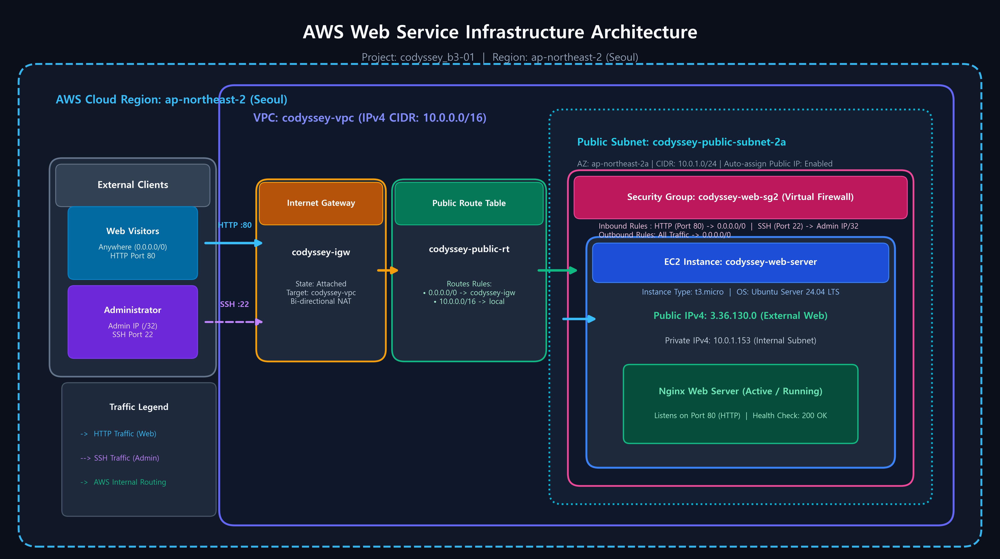

---

### 🧱 1. 바깥에서 안쪽으로 살펴보는 점진적(점차) 컴포넌트 구조

인프라는 외부 인터넷 세상에서부터 실제 웹 서버가 동작하는 컴퓨터 본체까지 **5단계 계층**으로 체계화되어 있습니다.

```text
[1단계: 외부 클라이언트] ──> [2단계: IGW & VPC] ──> [3단계: 라우팅 테이블] ──> [4단계: 퍼블릭 서브넷] ──> [5단계: 보안 그룹 & EC2]
```

| 계층 (컴포넌트) | 식별 정보 및 설정값 | 주요 역할 및 기술적 의의 |
| :--- | :--- | :--- |
| **1. External Clients (외부 클라이언트)** | • **Web Visitors**: `0.0.0.0/0` (HTTP :80)<br/>• **Administrator**: `<관리자 IP>/32` (SSH :22) | 웹 서비스를 이용하는 일반 방문객과 서버 유지보수를 담당하는 관리자로 트래픽을 엄격히 분리. |
| **2. VPC & IGW (사설망 및 대문)** | • **VPC**: `codyssey-vpc` (`10.0.0.0/16`)<br/>• **IGW**: `codyssey-igw` (양방향 1:1 NAT) | AWS 클라우드 내에 나만의 독립 사유지를 구축하고, 외부 인터넷 세상과 이어주는 유일한 공식 출입 관문(대문)을 연결. |
| **3. Public Route Table (교통 표지판)** | • **ID**: `codyssey-public-rt`<br/>• `0.0.0.0/0 -> codyssey-igw`<br/>• `10.0.0.0/16 -> local` | 서브넷에서 발생하는 트래픽의 길을 안내함. 외부 인터넷으로 나갈 패킷은 정문인 IGW로, 내부 통신은 VPC 로컬로 분기. |
| **4. Public Subnet (상가 분양 구역)** | • **ID**: `codyssey-public-subnet-2a`<br/>• 서울 리전 2a 가용영역 (`10.0.1.0/24`)<br/>• 퍼블릭 IP 자동 할당: 활성화 | 대규모 사유지(`10.0.0.0/16`, 65,536개)에서 웹 서버가 위치할 256개 크기의 전용 구역을 분할하고 인터넷 접근성 부여. |
| **5. Security Group (가상 방화벽)** | • **ID**: `codyssey-web-sg2`<br/>• 인바운드: HTTP(80) 전체 오픈, SSH(22) 내 IP 한정 | 서버 바로 앞(가상 랜카드 ENI)에서 포트 번호와 출발지 IP를 검문하는 초정밀 가상 방화벽. |
| **6. EC2 & Nginx (가상 서버 본체)** | • **인스턴스**: `codyssey-web-server` (`t3.micro`)<br/>• 공인 IP: `3.36.130.0` / 사설 IP: `10.0.1.153`<br/>• OS: Ubuntu 24.04 LTS / 웹 서버: Nginx | 24시간 중단 없이 80번 포트에서 요청을 대기하다가 접속한 사용자에게 HTML 웹페이지를 200 OK로 서빙하는 핵심 연산 컴퓨터. |

---

### 💡 2. 코딩 3개월 차도 100% 이해하는 눈높이 해설 (택배 배송 비유)

클라우드 단어가 너무 어렵게 느껴지시나요? 우리가 일상에서 이용하는 **"아파트 단지와 택배 배송"**으로 생각하면 아주 직관적입니다!

#### 📦 "내가 크롬 주소창에 `http://3.36.130.0`을 치고 엔터를 눌렀을 때 (0.03초의 기적)"
1. **택배 주문 (사용자 브라우저)**:  
   "서울시 강남구..."처럼 전 세계에 단 하나뿐인 우리 서버의 주민등록등본 주소(**공인 IP: `3.36.130.0`**)의 **80번 창구(HTTP 웹서핑용)**로 웹페이지를 달라는 편지(패킷)를 보냅니다.
2. **단지 정문 도착 및 주소 변환 (인터넷 게이트웨이, IGW)**:  
   편지가 아파트 단지 정문(IGW)에 도착합니다. 정문 경비실은 *"아, 밖에서 부르는 공인 IP `3.36.130.0`은 우리 단지 안쪽 101동 153호(**사설 IP: `10.0.1.153`**)를 말하는 거군!"* 하고 주소를 내부용으로 1:1 번역(NAT)해 줍니다.
3. **단지 내비게이션 확인 (라우팅 테이블, Route Table)**:  
   단지 안으로 들어온 택배 기사님이 도로 표지판을 봅니다. *"101동(`10.0.1.0/24`)으로 가려면 오른쪽 도로로 가세요!"*라는 표지판을 보고 정확한 서브넷으로 이동합니다.
4. **동 입구 도어락 검문 (보안 그룹, Security Group)**:  
   101동 현관 앞에 도착하자 인터폰 경비원(방화벽)이 검문합니다:  
   *"손님, 몇 번 용건으로 오셨나요?"* ➡️ *"80번 웹서핑 창구 보러 왔습니다."* ➡️ *"80번은 전 세계 누구나 환영이니 도어락 열어드립니다, 통과!"*
5. **안방 컴퓨터 응답 (EC2 & Nginx)**:  
   컴퓨터 안에서 24시간 대기 중이던 **Nginx 웹서버**가 편지를 받아 읽고, 준비해 둔 예쁜 안내장(`index.html`)을 상자에 담아 **`HTTP 200 OK` 도장을 쾅 찍어서** 손님 브라우저로 번개처럼 다시 배송합니다!

---

### 🔍 3. 주니어가 가장 자주 묻는 핵심 질문 3가지

> **Q1. 서버 컴퓨터에 사설 IP(`10.0.1.153`)가 있는데, 왜 굳이 퍼블릭 IP(`3.36.130.0`)가 따로 필요한가요?**  
> * **답변**: 사설 IP는 우리 아파트 단지(VPC) 안에서만 통하는 '101동 153호' 같은 내부 호수입니다. 바깥 인터넷 세상에는 '101동 153호'라는 집이 전 세계에 수천만 개가 있어서 외부 택배 기사님이 찾아올 수가 없습니다. 그래서 인터넷 세상 전체에서 나를 유일하게 찾을 수 있는 '도로명 공식 주소'인 **퍼블릭(공인) IP**가 반드시 매핑되어 있어야 외부 접속이 가능합니다.

> **Q2. 들어올 때(인바운드)는 80번 포트를 열어줬는데, 나갈 때(아웃바운드)는 왜 웹 응답 규칙을 안 열어도 웹페이지가 잘 나가나요?**  
> * **답변**: 보안 그룹은 **'상태 저장(Stateful)'**이라는 아주 똑똑한 특성을 가지고 있습니다. 자신이 직접 검사해서 들어오도록 허락해 준 손님(인바운드 통과 패킷)은 머릿속에 기억해 두기 때문에, 그 손님에게 답장을 돌려줄 때는 나가는 문(아웃바운드)을 별도로 열지 않아도 자동으로 프리패스 통과시켜 줍니다!

> **Q3. SSH 관리자 포트(22번)는 왜 귀찮게 내 컴퓨터 IP(`Admin IP/32`)만 적어놔야 하나요?**  
> * **답변**: 80번 문은 홈페이지를 보여주는 '전시용 쇼윈도'이지만, 22번 문은 서버 컴퓨터의 전원과 하드디스크를 통째로 조작할 수 있는 **'관리자 전용 비밀 통로'**입니다. 만약 22번 문을 전 세계(`0.0.0.0/0`)에 열어두면, 전 세계의 악성 봇과 해커들이 1초에 수백 번씩 비밀번호를 무차별 대입(Brute Force)하여 서버를 탈취하고 비트코인 채굴기를 돌려버립니다. 따라서 반드시 신뢰할 수 있는 관리자의 고유 IP에서만 문이 열리도록 잠가야 합니다.