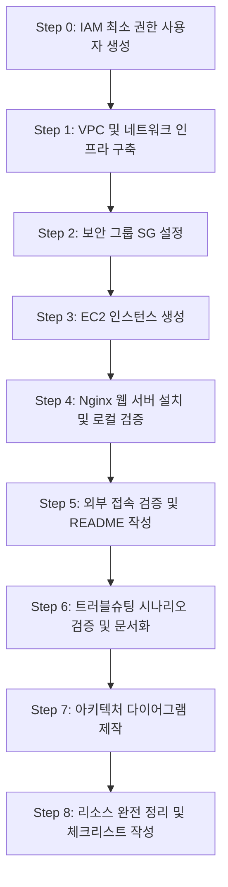

# [코디세이 b3-01] 웹 서비스 인프라 구축 및 외부 배포 문제 풀이 플랜

> **미션 명칭**: 내가 만든 웹사이트를 인터넷에 올려 누구나 쓰게 하기  
> **핵심 목표**: VPC 기반 격리된 네트워크 직접 설계, IAM 최소 권한 원칙 적용, EC2 웹 서버(Nginx) 배포, 보안 그룹 제어, 트러블슈팅 및 과금 방지 리소스 정리

---

## 1. 과제 개요 및 핵심 요구사항 분석

### 1.1 과제 목표
- 클라우드의 핵심 3요소인 **네트워크(VPC/Subnet/Routing), 보안(Security Group), 접근 권한(IAM)**을 직접 설계 및 구축합니다.
- 서울 리전(`ap-northeast-2`)의 AWS 프리티어 환경에서 격리된 VPC를 생성하고, EC2 가상 서버에 Nginx 웹 서버를 배포하여 외부 인터넷에서 정상 접속되도록 완성합니다.
- 통신/권한 오류를 가설-검증 방식으로 해결하는 트러블슈팅 역량과 안전한 리소스 정리(과금 방지) 프로세스를 확립합니다.

### 1.2 최종 제출물 요건 (4대 필수 산출물)
| 산출물 | 제출 규격 | 필수 포함 내용 |
| :--- | :--- | :--- |
| **1. 아키텍처 다이어그램** | `docs/architecture.(png\|pdf)` 1개 | VPC, Subnet, Internet Gateway, EC2, Security Group 구성 요소와 외부 $\to$ 서비스 트래픽 흐름 표현 |
| **2. 외부 접속 증빙** | `README.md` + 스크린샷 1장 이상 | 접속 검증 방식(A 또는 B 택1) 및 접속 정보(URL/IP) 기재 + 정상 응답(200 OK) 결과 스크린샷 |
| **3. 트러블슈팅 보고서** | `docs/troubleshooting.(md\|pdf)` 1개 | 최소 1건 이상에 대해 **증상 $\to$ 가설 $\to$ 검증 $\to$ 조치 $\to$ 결과 $\to$ 재발방지** 기록 |
| **4. 리소스 정리 체크리스트** | `docs/cleanup-checklist.md` 1개 | EC2, EBS, Elastic IP, IGW, VPC 등의 종료/삭제 확인 기록 + (선택) Billing/리소스 목록 스크린샷 |

### 1.3 제약 사항 체크리스트
- [ ] **리전**: 반드시 서울 리전(`ap-northeast-2`)에 생성
- [ ] **계정**: 루트(Root) 계정 콘솔 접근 금지 $\to$ **별도 생성한 IAM 사용자/역할**로만 접근
- [ ] **IAM 권한**: `AdministratorAccess` 부여 금지 $\to$ EC2/VPC/보안그룹에 필요한 최소 권한만 부여
- [ ] **컴퓨팅/스토리지**: 프리티어 대상 micro 인스턴스 1대 (`t2.micro` 또는 `t3.micro`), EBS 8~10 GiB
- [ ] **보안 그룹**:
  - HTTP(80): `0.0.0.0/0` (전체 허용)
  - SSH(22): 학습자 개인 공인 IP (`<내 IP>/32`)만 허용
  - `0.0.0.0/0` 대상 전체 포트(0-65535) 개방 규칙 생성 금지
- [ ] **운영/정리**: 실습 완료 즉시 리소스를 역순으로 완전 삭제하여 과금 0원 유지

---

## 2. 프로젝트 디렉토리 구조 계획

보너스 과제(Docker/HTTPS 등)를 제외한 필수 과제 기준의 명확하고 간결한 디렉토리 구조입니다:

```text
codyssey_b3-01/
├── README.md                      # [필수 2] 프로젝트 소개, 접속 방식(A/B) 및 접속 IP, 200 OK 증빙 스크린샷
├── 문제 풀이 플랜.md               # [가이드] 전체 문제 해결 및 작업 플랜 문서
├── 코디세이 b3-01 문제.txt         # 과제 원본 요구사항 파일
└── docs/
    ├── architecture.png           # [필수 1] 아키텍처 다이어그램 (PNG 또는 PDF)
    ├── troubleshooting.md         # [필수 3] 6단계 트러블슈팅 보고서
    └── cleanup-checklist.md       # [필수 4] 리소스 정리 및 과금 방지 체크리스트
```

---

## 3. 단계별 상세 실행 로드맵 (Step-by-Step)



---

### Step 0. IAM 최소 권한(Least Privilege) 사용자 생성

> **목표**: Root 계정 사용을 중단하고, EC2 및 VPC 관리에 꼭 필요한 권한만 가진 IAM 사용자로 작업

1. **Root 계정으로 로그인 후 IAM 콘솔 이동**
2. **IAM 사용자 생성**: 예) `codyssey-b3-user`
3. **최소 권한 인라인/고객 관리형 정책(Policy) 작성**:
   - `AdministratorAccess`는 절대 부여하지 않습니다.
   - EC2, VPC, 서브넷, 라우팅 테이블, IGW, 보안 그룹 관리에 필요한 작업만 허용합니다.
   ```json
   {
     "Version": "2012-10-17",
     "Statement": [
       {
         "Sid": "VPCAndNetworkManagement",
         "Effect": "Allow",
         "Action": [
           "ec2:CreateVpc",
           "ec2:DeleteVpc",
           "ec2:DescribeVpcs",
           "ec2:ModifyVpcAttribute",
           "ec2:CreateSubnet",
           "ec2:DeleteSubnet",
           "ec2:DescribeSubnets",
           "ec2:ModifySubnetAttribute",
           "ec2:CreateInternetGateway",
           "ec2:DeleteInternetGateway",
           "ec2:AttachInternetGateway",
           "ec2:DetachInternetGateway",
           "ec2:DescribeInternetGateways",
           "ec2:CreateRouteTable",
           "ec2:DeleteRouteTable",
           "ec2:DescribeRouteTables",
           "ec2:AssociateRouteTable",
           "ec2:DisassociateRouteTable",
           "ec2:CreateRoute",
           "ec2:DeleteRoute",
           "ec2:CreateSecurityGroup",
           "ec2:DeleteSecurityGroup",
           "ec2:DescribeSecurityGroups",
           "ec2:AuthorizeSecurityGroupIngress",
           "ec2:RevokeSecurityGroupIngress",
           "ec2:AuthorizeSecurityGroupEgress",
           "ec2:RevokeSecurityGroupEgress"
         ],
         "Resource": "*"
       },
       {
         "Sid": "EC2InstanceManagement",
         "Effect": "Allow",
         "Action": [
           "ec2:RunInstances",
           "ec2:TerminateInstances",
           "ec2:StartInstances",
           "ec2:StopInstances",
           "ec2:DescribeInstances",
           "ec2:DescribeInstanceStatus",
           "ec2:CreateKeyPair",
           "ec2:DeleteKeyPair",
           "ec2:DescribeKeyPairs",
           "ec2:DescribeImages",
           "ec2:DescribeVpcAttribute",
           "ec2:CreateTags"
         ],
         "Resource": "*"
       }
     ]
   }
   ```
4. **해당 IAM 사용자로 재로그인**하여 이후 모든 실습 진행.

---

### Step 1. 격리된 VPC 및 네트워크 인프라 구축

> **목표**: VPC 생성 $\to$ Public Subnet 생성 $\to$ IGW 생성/연결 $\to$ Route Table `0.0.0.0/0 -> IGW` 라우팅

1. **VPC 생성**:
   - 이름: `codyssey-vpc`
   - IPv4 CIDR: `10.0.0.0/16`
2. **Public Subnet 생성**:
   - VPC: `codyssey-vpc`
   - 서브넷 이름: `codyssey-public-subnet-2a`
   - 가용 영역(AZ): `ap-northeast-2a`
   - IPv4 CIDR: `10.0.1.0/24`
   - **서브넷 설정 변경**: 서브넷 선택 $\to$ 작업(Actions) $\to$ "서브넷 설정 편집" $\to$ **"퍼블릭 IPv4 주소 자동 할당 활성화"** 체크
3. **Internet Gateway(IGW) 생성 및 연결**:
   - 이름: `codyssey-igw`
   - 생성 후 `codyssey-vpc`에 연결(Attach to VPC)
4. **Route Table(라우팅 테이블) 설정**:
   - 이름: `codyssey-public-rt`
   - VPC: `codyssey-vpc`
   - **라우팅 편집**:
     - 대상(Destination): `0.0.0.0/0` $\to$ 대상(Target): `Internet Gateway` (`codyssey-igw`)
   - **서브넷 연결**: `codyssey-public-subnet-2a` 서브넷을 연결

---

### Step 2. 보안 그룹(Security Group) 구성

> **목표**: 인바운드 최소 포트(SSH는 내 IP, HTTP는 전체) 규칙 적용

1. **보안 그룹 생성**:
   - 이름: `codyssey-web-sg`
   - 설명: `Security group for public web server (HTTP and restricted SSH)`
   - VPC: `codyssey-vpc`
2. **인바운드 규칙(Inbound Rules) 설정**:
   | 유형 (Type) | 프로토콜 | 포트 범위 | 소스 (Source) | 설명 |
   | :--- | :--- | :--- | :--- | :--- |
   | **SSH** | TCP | `22` | **내 IP (`<학습자 공인 IP>/32`)** | 원격 관리 접속용 (외부 무작위 접속 차단) |
   | **HTTP** | TCP | `80` | `0.0.0.0/0` (Anywhere-IPv4) | 웹 브라우저 접속 허용 |

   > [!CAUTION]
   > 0-65535 전체 포트를 개방하거나, SSH(22)를 `0.0.0.0/0`으로 여는 것은 보안 위반 사항입니다.
3. **아웃바운드 규칙(Outbound Rules)**:
   - 모든 트래픽 허용 (`0.0.0.0/0`) 기본값 유지 (패키지 설치 및 외부 통신용)

---

### Step 3. EC2 인스턴스 프로비저닝

> **목표**: 프리티어 인스턴스 1대 시작 및 키페어 보관

1. **키 페어(Key Pair) 생성**:
   - 이름: `codyssey-key`
   - 유형: RSA / `.pem`
   - 안전한 로컬 폴더에 저장 (권한 설정: `chmod 400 codyssey-key.pem`)
2. **인스턴스 시작 (Launch Instance)**:
   - 이름: `codyssey-web-server`
   - AMI: **Ubuntu Server 24.04 LTS** (또는 Amazon Linux 2023)
   - 인스턴스 유형: `t2.micro` (또는 `t3.micro`)
   - 키 페어: `codyssey-key`
   - **네트워크 설정**:
     - VPC: `codyssey-vpc`
     - 서브넷: `codyssey-public-subnet-2a`
     - 퍼블릭 IP 자동 할당: **활성화**
     - 기존 보안 그룹: `codyssey-web-sg`
   - 스토리지: 8 GiB gp3 (기본값)
3. **실행 확인**: 인스턴스 상태가 `Running`이 되면 할당된 **퍼블릭 IPv4 주소** 복사.

---

### Step 4. 웹 서버(Nginx) 설치 및 서비스 구성

> **목표**: SSH 접속, 아웃바운드 인터넷 통신 확인, Nginx 설치 및 `/health` 구성

1. **SSH 접속**:
   ```bash
   ssh -i /path/to/codyssey-key.pem ubuntu@<EC2-퍼블릭-IP>
   ```
2. **아웃바운드 인터넷 통신 검증 (필수 요구사항)**:
   ```bash
   curl -I https://example.com
   # HTTP 200 응답이 오면 IGW 및 서브넷 라우팅 정상 동작 확인 완료!
   ```
3. **Nginx 설치 및 실행**:
   ```bash
   sudo apt-get update -y
   sudo apt-get install -y nginx
   sudo systemctl start nginx
   sudo systemctl enable nginx
   sudo systemctl status nginx
   ```
4. **`/health` 헬스체크 엔드포인트 구성 (방식 B 대비)**:
   ```bash
   # 기본 웹 디렉토리에 health 파일 생성
   echo "OK" | sudo tee /var/www/html/health
   ```
   *(또는 `/etc/nginx/sites-available/default`의 location 블록에 `location /health { return 200 "OK\n"; }` 추가 후 `sudo systemctl reload nginx`)*
5. **인스턴스 내부 로컬 호출 테스트 (필수 요구사항)**:
   ```bash
   curl http://localhost
   curl http://localhost/health
   # 200 응답 및 "OK" 출력 확인
   ```

---

### Step 5. 외부 접속 검증 및 `README.md` 작성

> **목표**: 외부에서 접속 확인(방식 A/B 택1), 증빙 스크린샷 캡처 및 `README.md`에 기록

1. **외부 접속 검증 방식 선택 (택 1)**:
   - **방식 (A)**: 로컬 PC 브라우저에서 `http://<EC2-퍼블릭-IP>` 접속 $\to$ Nginx 기본 페이지 확인
   - **방식 (B)**: 로컬 PC 브라우저 또는 터미널에서 `http://<EC2-퍼블릭-IP>/health` 호출 $\to$ `200 OK` 및 `OK` 텍스트 확인
2. **증빙 스크린샷 확보**:
   - 브라우저 주소창의 퍼블릭 IP와 200 OK 응답 내용이 함께 보이는 화면 캡처
   - 저장 위치: `docs/screenshot-external-access.png` (또는 README에 직접 첨부)
3. **`README.md` 작성 내용**:
   - 인프라 아키텍처 요약
   - 선택한 검증 방식 (A 또는 B 명시)
   - 접속 URL/IP: `http://<EC2-퍼블릭-IP>` 또는 `http://<EC2-퍼블릭-IP>/health`
   - 접속 결과 스크린샷 이미지 삽입

---

### Step 6. 트러블슈팅 시나리오 실습 및 보고서 작성

> **목표**: `docs/troubleshooting.md`에 6단계(증상 $\to$ 가설 $\to$ 검증 $\to$ 조치 $\to$ 결과 $\to$ 재발방지)로 작성

#### 실습 추천 시나리오: 보안 그룹 80번 포트 미개방 장애 재현
1. **증상 (Symptom)**: 인스턴스 내부에서는 `curl http://localhost`가 성공하지만, 외부 브라우저에서 `http://<퍼블릭IP>` 접속 시 무한 로딩 후 타임아웃(`ERR_CONNECTION_TIMED_OUT`) 발생.
2. **가설 (Hypothesis)**: 보안 그룹 인바운드 규칙에 HTTP(80) 포트가 누락되었거나 허용 소스가 잘못 지정되어 패킷이 차단되고 있을 것이다.
3. **검증 (Verification)**: 로컬 터미널에서 포트 스캔(`nc -zvw3 <퍼블릭IP> 80` 또는 PowerShell `Test-NetConnection -Port 80`) 실패 확인. AWS 콘솔에서 `codyssey-web-sg` 규칙 확인 결과 SSH(22)만 있고 HTTP(80) 없음 확인.
4. **조치 (Remediation)**: 보안 그룹 인바운드 규칙에 `HTTP / TCP / 80 / 0.0.0.0/0` 추가 저장.
5. **결과 (Result)**: 외부 브라우저 및 curl 요청 시 즉시 `HTTP 200 OK` 정상 응답 수신.
6. **재발 방지 (Prevention)**: 웹 서버 인프라 체크리스트에 '필수 서비스 포트 인바운드 등록 확인' 단계 추가.

---

### Step 7. 아키텍처 다이어그램 작성

> **목표**: `docs/architecture.png` (또는 `pdf`) 작성

- **다이어그램 필수 표현 요소**:
  - AWS Cloud 및 서울 리전(`ap-northeast-2`)
  - VPC (`10.0.0.0/16`)
  - Internet Gateway (IGW)
  - Public Subnet (`10.0.1.0/24`)
  - Route Table (`0.0.0.0/0 -> IGW`)
  - Security Group (Port 80, Port 22)
  - EC2 Web Server (`t2/t3.micro`, Nginx)
  - **외부 클라이언트 $\to$ 인터넷 $\to$ IGW $\to$ 서브넷 $\to$ 보안 그룹 $\to$ EC2로 이어지는 트래픽 흐름(화살표)**
- **도구**: Draw.io, Cloudcraft, Canva 등을 활용해 깔끔한 다이어그램 작성 후 PNG 파일로 저장.

---

### Step 8. 리소스 완전 정리 및 과금 방지 검증

> **목표**: 실습 종료 즉시 생성 리소스를 모두 삭제하고 `docs/cleanup-checklist.md` 작성

1. **정리 순서 (종속성 역순)**:
   ```text
   1. EC2 인스턴스 종료 (Terminate)
      └── 연결된 루트 볼륨(EBS) 자동 삭제 확인
   2. 미사용 볼륨 확인 (EBS 콘솔에서 남은 볼륨 없는지 확인)
   3. 탄력적 IP(EIP) 해제 (Release) (생성한 경우)
   4. Internet Gateway 분리(Detach) 후 삭제(Delete)
   5. 서브넷(Subnet) 삭제
   6. 라우팅 테이블 및 보안 그룹(Security Group) 삭제
   7. VPC 삭제 (Delete VPC)
   8. IAM 사용자/키 정리 (필요 시)
   ```
2. **검증**: AWS Billing & Cost Management 대시보드에서 추가 과금 요인이 없음을 확인.
3. **체크리스트 작성**: `docs/cleanup-checklist.md`에 완료 상태 기록.

---

## 4. 즉시 활용 가능한 설정 및 템플릿 코드

### 4.1 EC2 User Data 스크립트 (인스턴스 생성 시 자동 Nginx 세팅)
인스턴스 생성 화면의 '고급 세부 정보' $\to$ '사용자 데이터(User data)'에 아래 내용을 붙여넣으면 생성 즉시 웹 서버와 `/health`가 자동 구축됩니다:
```bash
#!/bin/bash
apt-get update -y
apt-get install -y nginx

# 기본 인덱스 웹 페이지 작성
cat <<EOF > /var/www/html/index.html
<!DOCTYPE html>
<html lang="ko">
<head>
  <meta charset="UTF-8">
  <title>Codyssey B3-01 Web Service</title>
  <style>
    body { font-family: -apple-system, BlinkMacSystemFont, 'Segoe UI', Roboto, sans-serif; display: flex; justify-content: center; align-items: center; height: 100vh; background: #0f172a; color: #f8fafc; margin: 0; }
    .card { background: #1e293b; padding: 2.5rem; border-radius: 16px; border: 1px solid #334155; text-align: center; box-shadow: 0 10px 25px rgba(0,0,0,0.5); }
    h1 { color: #38bdf8; margin-bottom: 0.5rem; }
    p { color: #94a3b8; font-size: 1.1rem; }
    .status { display: inline-block; margin-top: 1rem; padding: 0.4rem 1rem; background: #065f46; color: #34d399; border-radius: 9999px; font-weight: bold; }
  </style>
</head>
<body>
  <div class="card">
    <h1>🚀 웹 서비스 배포 성공!</h1>
    <p>AWS VPC & EC2 기반 웹 서비스가 정상 동작 중입니다.</p>
    <div class="status">HTTP 200 OK</div>
  </div>
</body>
</html>
EOF

# /health 엔드포인트 파일 작성
echo "OK" > /var/www/html/health

# Nginx 활성화 및 재시작
systemctl enable nginx
systemctl restart nginx
```

### 4.2 트러블슈팅 보고서 템플릿 (`docs/troubleshooting.md`)
```markdown
# 트러블슈팅 보고서: 외부 웹 접속 불가 장애 분석 및 해결

## 1. 개요
- **일시**: 2026-09-15
- **환경**: AWS 서울 리전(ap-northeast-2), Ubuntu 24.04 LTS, Nginx 1.24
- **인스턴스 IP**: `XX.XX.XX.XX`

## 2. 6단계 트러블슈팅 진행 과정

### 1단계: 증상 (Symptom)
- EC2 인스턴스 내부에서는 `curl http://localhost` 호출 시 정상적으로 200 OK 응답을 받음.
- 그러나 외부 PC 브라우저에서 `http://<인스턴스_퍼블릭_IP>` 접속 시 무한 로딩 후 `ERR_CONNECTION_TIMED_OUT` 발생.

### 2단계: 가설 (Hypothesis)
- [가설 A] 서브넷의 라우팅 테이블에 Internet Gateway(0.0.0.0/0 -> igw) 경로가 누락되어 외부와 통신할 수 없다.
- [가설 B] EC2에 연결된 보안 그룹(Security Group) 인바운드 규칙에 HTTP(80) 포트가 허용되어 있지 않다.

### 3단계: 검증 (Verification)
- 가설 A 검증: EC2 인스턴스 내부에서 `curl -I https://example.com` 실행 시 200 OK 응답 수신 $\to$ 아웃바운드 및 IGW 라우팅 정상 확인 (가설 A 기각).
- 가설 B 검증: 로컬 PC 터미널에서 `Test-NetConnection -ComputerName <IP> -Port 80` 실행 결과 실패. AWS 콘솔에서 `codyssey-web-sg`의 인바운드 규칙 확인 결과 SSH(22)만 등록되어 있고 HTTP(80) 포트가 없음 확인 (가설 B 채택).

### 4단계: 조치 (Remediation)
- AWS EC2 콘솔 $\to$ 보안 그룹(`codyssey-web-sg`) $\to$ 인바운드 규칙 편집.
- 규칙 추가: 프로토콜 `TCP`, 포트 `80`, 소스 `0.0.0.0/0` (Anywhere IPv4) 등록 후 저장.

### 5단계: 결과 (Result)
- 로컬 PC 브라우저에서 `http://<인스턴스_퍼블릭_IP>` 접속 시 웹 페이지 즉시 렌더링 확인.
- `curl -i http://<인스턴스_퍼블릭_IP>/health` 호출 결과 `HTTP/1.1 200 OK` 및 `OK` 텍스트 정상 수신.

### 6단계: 재발 방지 대책 (Prevention)
- 서비스 배포 전 '필수 개방 포트 체크리스트'를 점검하는 프로비저닝 표준 가이드라인 준수.
- 불필요한 포트 오픈을 방지하되, 서비스용 포트(80)와 관리용 포트(22)의 소스 IP 분리 원칙 상시 유지.
```

### 4.3 리소스 정리 체크리스트 템플릿 (`docs/cleanup-checklist.md`)
```markdown
# AWS 리소스 정리 및 과금 방지 체크리스트

| 점검 일시 | 점검자 | Billing 대시보드 상태 |
| :--- | :--- | :--- |
| 2026-09-15 | (학습자 이름 또는 IAM 사용자명) | $0.00 (과금 위험 항목 없음) |

## 리소스별 삭제 확인 목록

- [ ] **1. EC2 인스턴스 종료 (Terminate)**
  - 인스턴스 상태: `Terminated` 확인
- [ ] **2. EBS 볼륨 삭제 확인**
  - EC2 종료 후 잔존 볼륨 목록: 0개 확인 (루트 볼륨 자동 삭제)
- [ ] **3. 탄력적 IP (Elastic IP) 릴리스**
  - EIP 할당 목록 없음 확인
- [ ] **4. Internet Gateway 분리 및 삭제**
  - VPC에서 Detach 후 IGW 삭제 완료
- [ ] **5. 서브넷(Subnet) 삭제**
  - `codyssey-public-subnet-2a` 삭제 완료
- [ ] **6. 보안 그룹(Security Group) 삭제**
  - `codyssey-web-sg` 삭제 완료 (기본 default SG만 남음)
- [ ] **7. VPC 삭제**
  - `codyssey-vpc` 완전 삭제 완료
- [ ] **8. IAM 사용자/자격증명 확인**
  - 실습 완료 후 불필요한 액세스 키 비활성화
```

---

## 5. 실습 일정 및 작업 우선순위 권장안

| 순서 | 작업 항목 | 소요 시간 | 산출물 연계 |
| :---: | :--- | :---: | :--- |
| **Phase 1** | IAM 최소 권한 사용자 생성 및 콘솔 전환 | 15분 | 제약사항 준수 |
| **Phase 2** | VPC, Subnet, IGW, Route Table 생성 및 연결 | 20분 | 네트워크 인프라 완성 |
| **Phase 3** | Security Group 설정 및 EC2 인스턴스 시작 | 15분 | 보안 그룹 요구사항 충족 |
| **Phase 4** | Nginx 웹 서버 실행 및 `/health` 구성 | 15분 | 내부 200 OK 검증 |
| **Phase 5** | 외부 접속 검증 및 증빙 캡처 (`README.md`) | 15분 | **[필수 2] 외부 접속 증빙** |
| **Phase 6** | 의도적 오류 재현 및 트러블슈팅 보고서 작성 | 25분 | **[필수 3] 트러블슈팅 보고서** |
| **Phase 7** | 아키텍처 다이어그램 제작 (`docs/architecture.png`) | 25분 | **[필수 1] 아키텍처 다이어그램** |
| **Phase 8** | 리소스 완전 삭제 및 체크리스트 작성 | 15분 | **[필수 4] 리소스 정리 체크리스트** |

---

이 플랜은 보너스 항목을 제외하고 **채점 기준 100% 만족 및 4대 필수 결과물 완벽 제출**에 초점을 맞추어 설계되었습니다.
