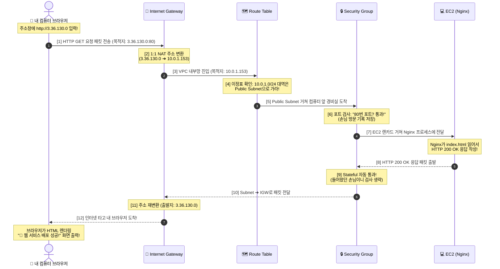

# [Step 0] IAM 최소 권한 사용자 생성 가이드 및 쉬운 해설서 (익스프레인포미)

> **이 문서의 목적**: 코딩 3개월 차 입문자도 단번에 이해할 수 있도록, **AWS 콘솔(웹 화면)에서 지금 당장 무엇을 클릭해야 하는지**, **어떤 코드를 넣어야 하는지**, 그리고 **도대체 왜 이렇게 복잡하게 하는지**를 비유와 함께 풀어서 설명합니다.

---

## 1. 지금 당장 AWS 콘솔(웹 브라우저)에서 해야 할 일 순서

이 작업은 내 컴퓨터 안의 VS Code가 아니라, **인터넷 브라우저로 AWS 사이트에 들어가서 마우스로 클릭하며 진행하는 작업(외부 작업)**입니다.

### [1단계] 루트(Root) 계정으로 AWS 로그인
1. [AWS 콘솔 로그인 페이지](https://aws.amazon.com/ko/console/)에 접속합니다.
2. **루트 사용자**를 선택하고 가입했던 이메일과 비밀번호로 로그인합니다.

### [2단계] IAM 메뉴로 이동
1. 화면 상단 검색창에 `IAM`을 입력하고, 검색 결과 맨 위에 나오는 **IAM(Identity and Access Management)**을 클릭합니다.
2. 왼쪽 사이드바 메뉴에서 **사용자(Users)**를 클릭합니다.
3. 주황색 **사용자 생성(Create user)** 버튼을 누릅니다.

### [3단계] 사용자 기본 정보 입력
1. **사용자 이름**: `codyssey-b3-user` 입력
2. **AWS Management Console에 대한 사용자 액세스 제공**: 반드시 **체크(선택)**!
3. **콘솔에 액세스할 사용자 지정**:
   - `IAM 사용자를 생성하고 싶음` 선택
4. **콘솔 비밀번호**:
   - `사용자 지정 비밀번호` 선택 $\to$ 기억하기 쉬운 안전한 비밀번호 입력 (예: `Codyssey1234!@#`)
   - `사용자는 다음 로그인 시 새 비밀번호를 생성해야 합니다`는 테스트의 편의를 위해 **체크 해제(권장)**
5. 오른쪽 아래 **다음(Next)** 클릭.

### [4단계] 권한 설정: 최소 권한 정책 만들기 (핵심!)
1. 세 가지 권한 옵션 중 **직접 정책 연결(Attach policies directly)**을 선택합니다.
2. `AdministratorAccess` 같은 관리자 권한을 찾아서 체크하면 **절대 안 됩니다! (과제 탈락 사유)**
3. 오른쪽 상단의 **정책 생성(Create policy)** 버튼을 클릭합니다. (새 브라우저 탭이 열립니다.)
4. 정책 편집 화면에서 **JSON** 탭을 클릭합니다.
5. 기존 내용을 싹 지우고, **아래 [2장]에 적힌 JSON 코드 전체를 복사해서 붙여넣기**합니다.
6. 오른쪽 아래 **다음(Next)** 클릭.
7. **정책 이름**: `CodysseyB3LeastPrivilegePolicy` 입력.
8. 오른쪽 아래 **정책 생성(Create policy)** 버튼 클릭!

### [5단계] 다시 사용자 생성 화면으로 돌아와 정책 연결 및 완료
1. 원래 열려 있던 **사용자 생성 브라우저 탭**으로 돌아옵니다.
2. '권한 정책' 목록 오른쪽에 있는 작은 **새로고침(↻) 아이콘**을 누릅니다.
3. 검색창에 `CodysseyB3LeastPrivilegePolicy`를 입력하여 방금 만든 정책을 찾은 뒤 **체크(선택)**합니다.
4. **다음(Next)** $\to$ 검토 화면에서 **사용자 생성(Create user)** 클릭!

### [6단계] 생성 완료 및 IAM 전용 로그인 URL 보관
1. 생성이 끝나면 화면에 **콘솔 로그인 URL**이 나옵니다.  
   - 형식: `https://<내-계정-ID>.signin.aws.amazon.com/console`
2. 이 링크를 복사해서 메모장에 적어둡니다.
3. **루트 계정은 이제 로그아웃**하거나 시크릿 창(Incognito)을 엽니다.
4. 방금 복사한 URL로 접속해서, 방금 만든 사용자명(`codyssey-b3-user`)과 비밀번호로 로그인합니다.

---

## 2. 우리가 붙여넣은 관련 코드 (IAM 정책 JSON)

```json
{
  "Version": "2012-10-17",
  "Statement": [
    {
      "Sid": "AllowVPCAndNetworkManagement",
      "Effect": "Allow",
      "Action": [
        "ec2:CreateVpc",
        "ec2:DeleteVpc",
        "ec2:DescribeVpcs",
        "ec2:ModifyVpcAttribute",
        "ec2:CreateSubnet",
        "ec2:DeleteSubnet",
        "ec2:DescribeSubnets",
        "ec2:ModifySubnetAttribute",
        "ec2:CreateInternetGateway",
        "ec2:DeleteInternetGateway",
        "ec2:AttachInternetGateway",
        "ec2:DetachInternetGateway",
        "ec2:DescribeInternetGateways",
        "ec2:CreateRouteTable",
        "ec2:DeleteRouteTable",
        "ec2:DescribeRouteTables",
        "ec2:AssociateRouteTable",
        "ec2:DisassociateRouteTable",
        "ec2:CreateRoute",
        "ec2:DeleteRoute",
        "ec2:CreateSecurityGroup",
        "ec2:DeleteSecurityGroup",
        "ec2:DescribeSecurityGroups",
        "ec2:AuthorizeSecurityGroupIngress",
        "ec2:RevokeSecurityGroupIngress",
        "ec2:AuthorizeSecurityGroupEgress",
        "ec2:RevokeSecurityGroupEgress"
      ],
      "Resource": "*"
    },
    {
      "Sid": "AllowEC2InstanceManagement",
      "Effect": "Allow",
      "Action": [
        "ec2:RunInstances",
        "ec2:TerminateInstances",
        "ec2:StartInstances",
        "ec2:StopInstances",
        "ec2:DescribeInstances",
        "ec2:DescribeInstanceStatus",
        "ec2:CreateKeyPair",
        "ec2:DeleteKeyPair",
        "ec2:DescribeKeyPairs",
        "ec2:DescribeImages",
        "ec2:DescribeVpcAttribute",
        "ec2:CreateTags"
      ],
      "Resource": "*"
    }
  ]
}
```

---

## 3. 그렇게 하는 이유 (보안과 과금 방지의 핵심)

### 3.1 왜 '루트(Root) 계정'을 쓰면 안 되나요?
- **루트 계정**은 신용카드 결제 수단 변경, 계정 영구 삭제, 전 세계 모든 AWS 리소스를 무제한으로 켤 수 있는 **'마스터키'**입니다.
- 개발자가 실수로 루트 계정의 비밀번호나 API 키(Access Key)를 깃허브(GitHub)에 올리는 순간, 5분 만에 전 세계 해커들이 몰려와 고성능 비트코인 채굴 서버를 100대씩 띄워 **수천만 원~수억 원의 청구서**가 날아옵니다.
- 그래서 실무에서는 루트 계정으로 MFA(2차 인증)를 걸어 잠가두고 금고에 넣어두듯 절대 평소에 쓰지 않습니다.

### 3.2 왜 'AdministratorAccess'를 주면 안 되나요?
- `AdministratorAccess`는 "AWS에 있는 모든 서비스를 마음대로 다 써도 된다"는 프리패스 권한입니다.
- 과제 요구사항이자 실무 표준은 **'최소 권한의 원칙(Principle of Least Privilege)'**입니다.
- "내가 이번 과제에서 할 일은 VPC(네트워크) 만들고, EC2(컴퓨터) 1대 띄우는 것뿐인데 왜 S3(파일저장소)나 RDS(데이터베이스)를 건드릴 수 있는 권한까지 줘야 하지?"라는 질문에서 출발합니다.
- 꼭 필요한 권한만 쥐여주면, 실수를 하거나 계정이 탈취당해도 다른 서비스가 망가지거나 예상치 못한 서비스로 과금 폭탄을 맞을 위험을 원천 차단할 수 있습니다.

---

## 4. [2차 해석] 코딩 3개월 차를 위한 초보자 맞춤 주석 & 비유 설명

클라우드와 JSON 정책이 처음이어도 100% 이해할 수 있도록 일상생활에 빗대어 설명해 드릴게요!

### 💡 일상생활 비유로 이해하기
> **루트 계정**: 내 전 재산이 든 통장의 **'인감도장과 신용카드'**  
> $\rightarrow$ 편의점에 우유 사러 가는데 인감도장을 들고 갈 수는 없겠죠?
> 
> **IAM 사용자 (`codyssey-b3-user`)**: 동생에게 심부름 보낼 때 쥐여주는 **'체크카드'**  
> $\rightarrow$ 이 체크카드에는 **"편의점에서 우유(VPC)와 빵(EC2)만 살 수 있고, 옆 건물 백화점(S3/RDS 등)에서는 결제가 아예 안 되도록"** 한도를 걸어둔 것입니다.

---

### 🔍 JSON 코드 줄 단위 해설 (주석 버전)

```javascript
{
  // 1. "Version": AWS가 정책 문법 규격을 정해둔 날짜입니다. (그냥 고정값 2012-10-17로 적습니다.)
  "Version": "2012-10-17",

  // 2. "Statement": 권한 규칙들의 목록(배열)입니다.
  "Statement": [
    {
      // 규칙 1: 네트워크(VPC) 공사를 위한 권한 묶음
      "Sid": "AllowVPCAndNetworkManagement",
      
      // "Effect": 허용할 것이냐("Allow"), 막을 것이냐("Deny")
      "Effect": "Allow",
      
      // "Action": 구체적으로 '무슨 버튼을 누를 수 있게 할 것인가?'
      "Action": [
        "ec2:CreateVpc",               // 땅(VPC) 파기 허용
        "ec2:DeleteVpc",               // 과제 끝나면 땅 메우기(VPC 삭제) 허용
        "ec2:DescribeVpcs",            // 내가 만든 땅이 잘 파졌나 목록 보기(조회) 허용
        "ec2:ModifyVpcAttribute",       // 땅 설정 바꾸기(DNS 이름 사용 등) 허용
        
        "ec2:CreateSubnet",            // 땅 안에 구역(서브넷) 나누기 허용
        "ec2:DeleteSubnet",            // 서브넷 삭제 허용
        "ec2:DescribeSubnets",           // 서브넷 목록 조회 허용
        "ec2:ModifySubnetAttribute",     // "퍼블릭 IP 자동 할당" 체크박스 켤 수 있게 허용
        
        "ec2:CreateInternetGateway",   // 인터넷으로 나가는 문(인터넷 게이트웨이) 만들기 허용
        "ec2:DeleteInternetGateway",   // 게이트웨이 삭제 허용
        "ec2:AttachInternetGateway",   // 게이트웨이를 우리 땅(VPC)에 연결하기 허용
        "ec2:DetachInternetGateway",   // 과제 끝나고 게이트웨이 떼어내기 허용
        "ec2:DescribeInternetGateways",// 게이트웨이 상태 확인 허용
        
        "ec2:CreateRouteTable",        // 이정표(라우팅 테이블) 만들기 허용
        "ec2:DeleteRouteTable",        // 이정표 삭제 허용
        "ec2:DescribeRouteTables",     // 이정표 확인 허용
        "ec2:AssociateRouteTable",     // 이정표를 특정 구역(서브넷)에 세워두기 허용
        "ec2:DisassociateRouteTable",  // 이정표 떼기 허용
        "ec2:CreateRoute",             // "인터넷으로 가려면 저 문(IGW)으로 가라" 길 안내 규칙 적기 허용
        "ec2:DeleteRoute",             // 길 안내 규칙 지우기 허용
        
        "ec2:CreateSecurityGroup",     // 경비실(보안 그룹) 짓기 허용
        "ec2:DeleteSecurityGroup",     // 경비실 부수기 허용
        "ec2:DescribeSecurityGroups",  // 경비실 규칙 조회 허용
        "ec2:AuthorizeSecurityGroupIngress", // "80번 포트 손님 들어오세요" 들어오는 문 열어주기 허용
        "ec2:RevokeSecurityGroupIngress",    // 열어둔 문 닫기 허용
        "ec2:AuthorizeSecurityGroupEgress",  // "서버에서 밖으로 나가는 건 다 나가세요" 허용
        "ec2:RevokeSecurityGroupEgress"      // 나가는 문 닫기 허용
      ],
      // "Resource": "*" -> 어떤 VPC, 어떤 서브넷이든 위 작업들을 할 수 있게 허용한다는 뜻입니다.
      "Resource": "*"
    },
    {
      // 규칙 2: 가상 컴퓨터(EC2)를 다루기 위한 권한 묶음
      "Sid": "AllowEC2InstanceManagement",
      "Effect": "Allow",
      "Action": [
        "ec2:RunInstances",            // 컴퓨터(EC2 인스턴스) 전원 켜기 / 새로 만들기 허용
        "ec2:TerminateInstances",      // 과제 끝나면 컴퓨터 폐기(삭제)하기 허용 -> 과금 방지에 필수!
        "ec2:StartInstances",          // 멈춘 컴퓨터 다시 켜기
        "ec2:StopInstances",           // 컴퓨터 잠시 끄기
        "ec2:DescribeInstances",       // 내 컴퓨터가 지금 켜졌는지(Running) 확인 허용
        "ec2:DescribeInstanceStatus",   // 컴퓨터 건강상태(2/2 검사 통과 여부) 조회 허용
        
        "ec2:CreateKeyPair",           // 컴퓨터에 들어갈 열쇠(SSH 키페어 .pem) 만들기 허용
        "ec2:DeleteKeyPair",           // 열쇠 지우기 허용
        "ec2:DescribeKeyPairs",        // 내 열쇠 목록 보기 허용
        
        "ec2:DescribeImages",          // 우분투(Ubuntu 24.04) OS 이미지 고르기 허용
        "ec2:DescribeVpcAttribute",    // VPC 속성 읽어오기 허용
        "ec2:CreateTags"               // 컴퓨터에 'codyssey-web-server'라고 이름표(Tag) 붙이기 허용
      ],
      "Resource": "*"
    }
  ]
}
```

---

# [Step 1] VPC 및 서브넷 네트워크 인프라 구축 가이드 (익스프레인포미)

> **이 단계의 목적**: 구름(AWS) 위에 아무도 침범할 수 없는 **나만의 가상 땅(VPC)**을 사고, 건물을 지을 **구역(Subnet)**을 나눈 뒤, 외부 인터넷과 통신할 수 있는 **대문(IGW)**과 **이정표(Route Table)**를 설치합니다.

---

## 1. 시작 전 절대 놓치면 안 되는 사전 확인!

### ⚠️ 리전(Region)을 "서울 (ap-northeast-2)"로 설정하기
1. AWS 콘솔 화면 맨 오른쪽 위를 보시면, 사용자 이름 옆에 **도시 이름(예: 버지니아 북부, 글로벌, 오레곤 등)**이 적혀 있습니다.
2. 거기를 클릭해서 반드시 **`아시아 태평양(서울) ap-northeast-2`**를 선택해 주세요!
3. **이유**: 과제 요구사항 7번에 *"모든 리소스는 서울 리전(ap-northeast-2)에 생성한다"*라고 못 박혀 있습니다. 만약 다른 나라 리전에 만들면 과제 채점이 불가능하고 연결도 되지 않습니다.

---

## 2. 웹 브라우저(AWS 콘솔)에서 클릭해야 할 순서

### [1단계] 나만의 사유지(VPC) 만들기
1. 콘솔 검색창에 `VPC`를 입력하고, 서비스 목록에서 **VPC**를 클릭합니다.
2. 주황색 **[VPC 생성 (Create VPC)]** 버튼을 클릭합니다.
3. 설정 옵션 입력:
   - **생성할 리소스**: **VPC 전용 (VPC only)** 선택
   - **이름 태그**: `codyssey-vpc`
   - **IPv4 CIDR 블록 수동 입력**: `10.0.0.0/16` 입력
   - (나머지 IPv6, 테넌시 등은 기본값 유지)
4. 오른쪽 아래 **[VPC 생성]** 버튼을 클릭합니다.

---

### [2단계] 건물 지을 구역(Public Subnet) 나누기 & 퍼블릭 IP 자동 할당 켜기
1. 왼쪽 메뉴 사이드바에서 **서브넷 (Subnets)**을 클릭합니다.
2. 주황색 **[서브넷 생성 (Create subnet)]** 버튼을 클릭합니다.
3. 설정 옵션 입력:
   - **VPC ID**: 방금 만든 `codyssey-vpc` 선택
   - **서브넷 이름**: `codyssey-public-subnet-2a`
   - **가용 영역 (AZ)**: `ap-northeast-2a` (서울 리전의 A구역)
   - **IPv4 서브넷 CIDR 블록**: `10.0.1.0/24` 입력
4. 오른쪽 아래 **[서브넷 생성]** 버튼을 클릭합니다.

> ⭐️ **[초특급 필수 설정] 퍼블릭 IP 자동 할당 활성화**  
> 이걸 안 켜면 나중에 만들 컴퓨터(EC2)에 외부에서 접속할 수 있는 인터넷 주소가 발급되지 않습니다!
> 1. 방금 생성된 `codyssey-public-subnet-2a` 서브넷 목록의 체크박스를 선택합니다.
> 2. 오른쪽 위 **[작업 (Actions)]** 드롭다운 메뉴 클릭 $\to$ **[서브넷 설정 편집 (Edit subnet settings)]** 클릭.:: 우리가 나중에 이 서브넷 안에 웹 서버 컴퓨터(EC2)를 설치할 텐데요, 이걸 켜두어야 AWS가 컴퓨터를 켤 때 자동으로 외부 인터넷 도로명 주소(퍼블릭 IP)를 부여해 주기 때문입니다! (안 켜면 외부에서 우리 웹사이트 주소를 몰라 접속할 수가 없어요.)
> 3. 첫 번째 항목인 **"퍼블릭 IPv4 주소 자동 할당 활성화 (Enable auto-assign public IPv4 address)"** 체크박스에 체크!
> 4. 아래로 내려가 **[저장]** 버튼을 누릅니다.

---

### [3단계] 바깥세상(인터넷)과 연결할 대문(Internet Gateway) 달아주기
1. 왼쪽 메뉴 사이드바에서 **인터넷 게이트웨이 (Internet Gateways)**를 클릭합니다.
2. 주황색 **[인터넷 게이트웨이 생성]** 버튼을 누릅니다.
3. **이름 태그**: `codyssey-igw` 입력 후 **[인터넷 게이트웨이 생성]** 클릭.

> ⭐️ **[필수 연결] 만든 대문을 우리 사유지(VPC) 담장에 달아주기**  
> 대문만 땅바닥에 덩그러니 만들어두면 아무 쓸모가 없습니다. 우리 VPC에 연결해야 합니다.
> 1. 생성 완료 화면 오른쪽 위 주황색 **[작업 (Actions)]** 버튼 클릭 $\to$ **[VPC에 연결 (Attach to VPC)]** 클릭.
> 2. 사용 가능한 VPC 목록에서 `codyssey-vpc`를 선택합니다.
> 3. **[인터넷 게이트웨이 연결]** 버튼 클릭!

---

### [4단계] 길 안내 이정표(Route Table) 세우고 인터넷 길 뚫어주기
1. 왼쪽 메뉴 사이드바에서 **라우팅 테이블 (Route Tables)**을 클릭합니다.
2. 주황색 **[라우팅 테이블 생성]** 버튼을 클릭합니다:
   - **이름**: `codyssey-public-rt`
   - **VPC**: `codyssey-vpc` 선택 후 **[라우팅 테이블 생성]** 클릭.
3. 생성된 `codyssey-public-rt`의 상세 화면에서 **2가지 핵심 작업**을 진행합니다:

#### ① 인터넷 길 안내 규칙 추가 (외부로 나가는 길 뚫기)
- 상세 화면 아래쪽의 **[라우팅 (Routes)]** 탭 클릭 $\to$ **[라우팅 편집 (Edit routes)]** 클릭.
- **[라우팅 추가 (Add route)]** 버튼 클릭:
  - **대상 (Destination)**: `0.0.0.0/0` 입력 (세상 모든 인터넷 주소를 뜻함)
  - **타깃 (Target)**: 클릭 후 **인터넷 게이트웨이(Internet Gateway)** 선택 $\to$ 아까 만든 `codyssey-igw` 선택.
- 오른쪽 아래 **[변경 사항 저장]** 클릭!

#### ② 이 이정표를 우리 서브넷에 세워두기 (서브넷 연결)
- [라우팅 테이블]상세 화면 아래쪽의 **[서브넷 연결 (Subnet associations)]** 탭 클릭 $\to$ **[서브넷 연결 편집 (Edit subnet associations)]** 클릭.
- 우리가 만든 `codyssey-public-subnet-2a` 체크박스에 체크!
- **[연결 저장]** 클릭!

---

## 3. 그렇게 하는 이유 (왜 이런 복잡한 단계를 거칠까요?)

1. **기본(Default) VPC를 쓰지 않고 왜 새 VPC를 만드나요?**
   - AWS는 계정을 파면 기본 네트워크(Default VPC)를 하나 자동으로 줍니다.
   - 하지만 실무에서는 여러 프로젝트나 개발/운영 환경이 섞이지 않도록 **완전히 격리된 독립 네트워크(VPC)**를 직접 파서 만드는 것이 기본 원칙입니다.
2. **왜 IGW(인터넷 게이트웨이)를 따로 만들어서 붙이나요?**
   - VPC는 기본적으로 바깥 세상과 완전히 단절된 '무인도' 상태입니다.
   - 인터넷에서 내 웹사이트를 보러 손님이 들어오거나, 서버가 우분투 패키지(`apt update`)를 다운로드하려면 인터넷으로 통하는 '관문'인 IGW가 반드시 열려 있어야 합니다.
3. **왜 라우팅 테이블에 `0.0.0.0/0 -> codyssey-igw`를 넣나요?**
   - 컴퓨터는 가고자 하는 목적지 IP가 사유지 내부(`10.0.0.0/16`)가 아니면 어디로 패킷을 보내야 할지 모릅니다.
   - "사유지 주소가 아닌 모든 외부 인터넷(`0.0.0.0/0`)으로 갈 거면 무조건 저 대문(`codyssey-igw`)으로 나가라!"라고 명시적으로 길을 알려주는 것입니다.

---

## 4. [2차 해석] 코딩 3개월 차를 위한 눈높이 비유 해설

클라우드 네트워크 용어가 낯설다면, **"신축 아파트 단지 공사"**를 떠올려보세요!

| 클라우드 용어 | 아파트 단지 비유 | 쉬운 설명 |
| :--- | :--- | :--- |
| **VPC (`10.0.0.0/16`)** | **아파트 단지 부지 (사유지)** | 다른 사람은 함부로 못 들어오게 높은 담장을 쳐둔 약 65,000평 크기의 우리 땅 |
| **Subnet (`10.0.1.0/24`)** | **101동 상가 구역** | 단지 안에서 용도별로 쪼갠 구역. 손님들이 자유롭게 드나들 수 있는 '상가 구역(Public)' |
| **퍼블릭 IP 자동 할당** | **상가 점포마다 외부 도로명 주소 부여** | 손님들이 찾아올 수 있는 진짜 바깥 도로명 주소(공인 IP)를 가게(서버) 열 때 자동으로 달아줌 |
| **Internet Gateway (IGW)** | **아파트 단지 정문 (대문)** | 단지 담장에 뚫어놓은 유일한 출입구. 이게 없으면 밖으로 나갈 수도, 손님이 들어올 수도 없음 |
| **Route Table (라우팅 테이블)** | **단지 내 삼거리 이정표 표지판** | "단지 밖(외부 인터넷 `0.0.0.0/0`)으로 나갈 차들은 1번 정문 대문(IGW)으로 가시오"라고 적어둔 표지판 |

---

## 5. Step 1 완료 확인 방법 (성공 체크)

위 4단계를 마쳤다면 다음 4가지가 준비된 것입니다:
1. `codyssey-vpc` (IPv4 CIDR: `10.0.0.0/16`) 생성 완료
2. `codyssey-public-subnet-2a` (`10.0.1.0/24`) 생성 및 퍼블릭 IP 자동 할당 켜짐
3. `codyssey-igw`가 `codyssey-vpc`에 `Attached(연결됨)` 상태
4. `codyssey-public-rt`에 `0.0.0.0/0 -> codyssey-igw` 라우트 등록 및 서브넷 연결 완료

여기까지 다 하셨다면 인프라의 뼈대가 완벽히 세워진 것입니다!  
---

# [Step 2] 보안 그룹(Security Group - 경비실) 설정 가이드 (익스프레인포미)

> **이 단계의 목적**: 우리 건물(EC2 서버) 바로 앞을 지키는 **경비실(가상 방화벽)**을 세우고, "웹사이트 구경하러 온 일반 손님(HTTP 80)"은 활짝 열어주되, "서버를 원격 조종하는 관리자 통로(SSH 22)"는 오직 **나(내 컴퓨터 IP)**만 통과하도록 철통 보안을 설정합니다.

---

## 1. 웹 브라우저(AWS 콘솔)에서 클릭해야 할 순서

### [1단계] 보안 그룹 메뉴로 이동하기
1. VPC 화면 왼쪽 사이드바 맨 아래쪽으로 스크롤을 내리면 **보안 (Security)** 카테고리가 보입니다.
2. 그 아래에 있는 **[보안 그룹 (Security groups)]**을 클릭합니다.  
   *(또는 상단 검색창에 `보안 그룹`을 검색해서 들어가도 됩니다.)*
3. 오른쪽 위의 주황색 **[보안 그룹 생성 (Create security group)]** 버튼을 클릭합니다.

---

### [2단계] 기본 정보 입력 (⚠️ VPC 선택 주의!)
1. **보안 그룹 이름**: `codyssey-web-sg`
2. **설명**: `Security group for public web server (HTTP and restricted SSH)`
3. ⭐️ **VPC 선택 (매우 중요!)**:
   - 기본으로 선택되어 있는 VPC 이름 옆의 `X`를 누르고, 우리가 Step 1에서 만든 **`codyssey-vpc`**를 반드시 선택합니다!
   - *(엉뚱한 기본 VPC를 선택하면 나중에 EC2 컴퓨터를 만들 때 이 보안 그룹이 목록에 나타나지 않습니다!)*

---

### [3단계] 인바운드 규칙 (Inbound Rules) 딱 2개 추가하기

> **인바운드 규칙**: 외부 인터넷에서 내 서버 안으로 "들어오는" 통로를 열어주는 규칙입니다.

화면 중간의 **인바운드 규칙** 상자에서 오른쪽의 **[규칙 추가 (Add rule)]** 버튼을 눌러 아래 2개의 규칙을 만들어줍니다:

#### 🔹 규칙 1: 관리자 전용 원격 접속 (SSH 22번 포트)
1. **유형 (Type)**: 드롭다운에서 **`SSH`** 선택 (포트 범위 22가 자동 입력됨)
2. **소스 (Source)**: 드롭다운을 열고 **`내 IP (My IP)`** 선택!
   - ⭐️ **꿀팁**: `내 IP`를 선택하면 AWS가 지금 내 컴퓨터의 공인 IP를 알아서 감지하여 `<내IP>/32` 형태로 자동으로 쏙 넣어줍니다!
3. **설명**: `SSH access for admin only`

#### 🔹 규칙 2: 누구나 접속 가능한 웹 서비스 (HTTP 80번 포트)
1. **[규칙 추가]** 버튼을 한 번 더 누릅니다.
2. **유형 (Type)**: 드롭다운에서 **`HTTP`** 선택 (포트 범위 80이 자동 입력됨)
3. **소스 (Source)**: 드롭다운에서 **`Anywhere-IPv4`** (또는 `0.0.0.0/0`) 선택!
4. **설명**: `Public web access`

> [!CAUTION]
> 과제 감점 및 보안 위반 주의!
> - 0~65535 전체 포트를 열거나, SSH(22)를 `0.0.0.0/0`(아무나)으로 여는 것은 절대 금지입니다.

---

### [4단계] 아웃바운드 규칙 확인 및 생성 완료
1. **아웃바운드 규칙**: 기본값으로 `모든 트래픽 (All traffic) / 0.0.0.0/0`이 들어가 있습니다. (수정하지 않고 그대로 둡니다!)
2. 화면 맨 아래 오른쪽 주황색 **[보안 그룹 생성]** 버튼을 클릭합니다!

---

## 2. 그렇게 하는 이유 (왜 이렇게 규칙을 짜나요?)

### 1. 왜 SSH(22번)는 '내 IP'로만 막아두어야 하나요?
- 22번 포트(SSH)는 서버의 심장부로 들어가 시스템 명령어를 실행할 수 있는 **'최고 관리자 전용 출입문'**입니다.
- 이걸 `0.0.0.0/0`(전 세계)에 열어두면, 전 세계 해커 봇들이 1초에 수백 번씩 비밀번호를 무차별 대입(Brute Force Attack)하여 서버를 해킹하고 암호화폐 채굴기로 악용합니다.
- 그래서 **"오직 우리 집/내 자리 컴퓨터(내 IP)에서만 관리 목적으로 들어올 수 있게"** 입구를 꽁꽁 묶어두는 것입니다.

### 2. 왜 HTTP(80번)는 `0.0.0.0/0`으로 활짝 여나요?
- 우리가 만드는 건 **"누구나 들어와서 구경할 수 있는 공개 웹사이트"**입니다.
- 서울, 부산, 미국, 일본 어디에 있는 손님이든 웹 브라우저로 내 웹페이지를 볼 수 있어야 하므로, 웹 표준 통로인 80번 포트는 전 세계 모든 인터넷(`0.0.0.0/0`)에 개방해야 합니다.

### 3. 아웃바운드는 왜 전부 열어두나요?
- 서버 컴퓨터도 `apt update`로 Nginx 웹서버 프로그램을 다운로드받고 외부 통신을 해야 합니다. 서버가 밖으로 나가는 길까지 막아버리면 아무런 프로그램도 설치할 수 없기 때문에 기본적으로 다 열어둡니다.

---

## 3. [2차 해석] 코딩 3개월 차를 위한 눈높이 비유 ("건물 로비 경비실")

보안 그룹은 서버 바로 앞에 서 있는 **"깐깐한 경비 아저씨와 스피드게이트"**입니다!

| 설정 항목 | 경비실 출입 통제 비유 | 쉬운 설명 |
| :--- | :--- | :--- |
| **HTTP (80번) $\to$ `0.0.0.0/0`** | **1층 로비 및 스타벅스 출입구** | "여기는 손님들이 차 마시고 구경하는 공개 매장이니 누구나 자유롭게 들어오세요!" |
| **SSH (22번) $\to$ `내 IP/32`** | **지하 1층 건물 방재실 / 기계실** | "여기는 건물 전원 내리는 중요한 곳이니, 건물주 신분증(내 IP) 가진 사장님 1명 빼고는 아무도 못 들어옵니다!" |
| **아웃바운드 (전체 허용)** | **건물 안 직원들의 자유로운 외출** | "건물 안 직원이 편의점 가거나 밥 먹으러 나가는 건 얼마든지 나갔다 오세요!" |

---

## 4. Step 2 완료 확인 방법 (성공 체크)

보안 그룹 목록에 다음 내용이 등록되어 있다면 Step 2 성공입니다:
1. 보안 그룹 이름: `codyssey-web-sg`
2. VPC: `codyssey-vpc`에 소속됨
3. 인바운드 규칙 2개:
   - 포트 22: `<내 IP>/32`
   - 포트 80: `0.0.0.0/0`

---

# [Step 3] EC2 인스턴스(컴퓨터) 1대 띄우기 가이드 (익스프레인포미)

> **이 단계의 목적**: 우리가 만든 사유지(VPC)의 상가 구역(Public Subnet)에, 우리가 세운 경비실(Security Group)의 보호를 받는 **진짜 가상 컴퓨터(EC2 인스턴스 1대)**를 조립하고 전원을 켭니다!

---

## 1. 웹 브라우저(AWS 콘솔)에서 클릭해야 할 순서

### [1단계] EC2 서비스로 이동하기
1. 화면 맨 위 검색창에 `EC2`를 입력하고, 맨 위에 나오는 **EC2** 서비스를 클릭합니다.
2. 왼쪽 사이드바 메뉴에서 **[인스턴스 (Instances)]**를 클릭합니다.
3. 오른쪽 위의 주황색 **[인스턴스 시작 (Launch instance)]** 버튼을 클릭합니다.

---

### [2단계] 컴퓨터 이름 및 운영체제(OS) 고르기
1. **이름 및 태그 (Name)**:
   - 이름: `codyssey-web-server` 입력
2. **애플리케이션 및 OS 이미지 (Amazon Machine Image, AMI)**:
   - 퀵 스타트에서 **`Ubuntu`** 로고를 클릭합니다.
   - 아래 드롭다운에서 **`Ubuntu Server 24.04 LTS (HVM), SSD Volume Type`** (또는 `22.04 LTS`)이 선택되어 있는지 확인합니다.
   - ⭐️ 초록색으로 **"프리 티어 사용 가능 (Free tier eligible)"** 배지가 달려있는지 꼭 확인하세요!

---

### [3단계] 컴퓨터 사양(인스턴스 유형) 고르기
1. **인스턴스 유형 (Instance type)**:
   - 기본으로 **`t2.micro`** (또는 `t3.micro`)가 선택되어 있습니다. 그대로 둡니다!
   - ⭐️ 역시 초록색으로 **"프리 티어 사용 가능"**이라고 적혀 있습니다. (다른 큰 걸 고르면 요금이 나옵니다!)

---

### [4단계] 컴퓨터 출입 열쇠(키 페어) 만들기 ⭐️⭐️⭐️ (매우 중요!)
이 컴퓨터에는 모니터와 키보드가 없습니다. 내 컴퓨터에서 원격으로 접속하려면 **암호 열쇠 파일(`.pem`)**이 반드시 필요합니다!

1. **키 페어 (로그인)** 항목에서 오른쪽에 있는 파란색 글씨 **[새 키 페어 생성 (Create new key pair)]**을 클릭합니다. (팝업창이 뜹니다.)
2. 팝업창 입력:
   - **키 페어 이름**: `codyssey-key` 입력
   - **키 페어 유형**: `RSA` 선택
   - **프라이빗 키 파일 형식**: **`.pem`** (OpenSSH용) 선택
3. 주황색 **[키 페어 생성 (Create key pair)]** 버튼 클릭!
4. ⭐️ **주의**: 버튼을 누르면 브라우저 다운로드 폴더에 **`codyssey-key.pem`** 파일이 자동으로 다운로드됩니다.
   - **이 파일은 절대로 지우면 안 됩니다!** AWS에서도 두 번 다시 다운로드받을 수 없는 단 하나의 유일한 열쇠입니다.

---

### [5단계] 네트워크 설정 편집 (⭐️ 제일 중요! 놓치기 쉬운 곳!)

기본값으로 두면 엉뚱한 기본 VPC에 컴퓨터가 생깁니다. 반드시 우리가 만든 땅으로 지정해야 합니다!

1. **네트워크 설정 (Network settings)** 상자 오른쪽 위에 있는 **[편집 (Edit)]** 버튼을 누릅니다.
2. 아래 4가지 항목을 꼼꼼하게 바꿉니다:
   - **VPC**: 기본값 대신 우리가 만든 **`codyssey-vpc`** 선택!
   - **서브넷 (Subnet)**: 우리가 만든 **`codyssey-public-subnet-2a`** 선택!
   - **퍼블릭 IP 자동 할당 (Auto-assign public IP)**: **`활성화 (Enable)`**로 선택!
   - **방화벽 (보안 그룹)**:
     - "보안 그룹 생성" 대신 **`기존 보안 그룹 선택 (Select existing security group)`**에 체크!
     - 목록에서 우리가 Step 2에서 만든 **`codyssey-web-sg`**를 체크(선택)!

---

### [6단계] 스토리지(하드디스크 SSD) 확인 및 인스턴스 시작
1. **스토리지 구성 (Configure storage)**:
   - `1x 8 GiB gp3` (기본값) 그대로 유지합니다. (프리티어는 30GB까지 무료이므로 8~10GB면 아주 넉넉하고 안전합니다.)
2. 화면 맨 오른쪽 아래에 있는 커다란 주황색 **[인스턴스 시작 (Launch instance)]** 버튼을 클릭합니다!
3. 화면에 "성공" 메시지가 뜨면, 맨 아래 **[모든 인스턴스 보기]** 버튼을 클릭합니다.

---

## 2. 그렇게 하는 이유 (왜 이렇게 설정하나요?)

### 1. 왜 Ubuntu LTS인가요?
- 리눅스는 전 세계 웹 서버의 90% 이상이 사용하는 표준 운영체제입니다.
- 그중 **Ubuntu**는 초보자도 다루기 쉽고 패키지 설치(`apt-get`)가 직관적입니다.
- **LTS (Long Term Support)**는 5년 동안 보안 업데이트를 안정적으로 보장해 주는 기업용 안정 버전입니다.

### 2. 왜 `t2.micro`인가요?
- AWS 계정을 처음 파면 1년 동안 매달 750시간(24시간 한 달 내내 켜두어도 되는 시간) 동안 무료로 쓸 수 있는 **프리티어 무료 규격**이기 때문입니다.

### 3. 왜 키 페어(`.pem`)를 한 번만 다운로드받게 하나요?
- 이건 '공개키 암호화(Public Key Cryptography)' 방식입니다.
- 자물쇠(공개키)는 AWS 서버에 채워두고, 그 자물쇠를 열 수 있는 진짜 열쇠(비밀키, `.pem`)는 사용자에게 딱 1개만 건네줍니다.
- AWS조차 해킹당해도 사용자 비밀키를 알 수 없도록 보관하지 않으므로, **사용자가 잃어버리면 아무도 다시 열어줄 수 없습니다.** 그래서 안전하게 내 컴퓨터에 보관해야 합니다.

### 4. 왜 네트워크 설정을 수동으로 바꿨나요?
- 우리가 Step 1과 Step 2에서 기껏 정성스럽게 파놓은 사유지(`codyssey-vpc`), 상가 구역(`codyssey-public-subnet-2a`), 경비실(`codyssey-web-sg`)에 이 컴퓨터를 입주시키기 위해서입니다!

---

## 3. [2차 해석] 코딩 3개월 차를 위한 눈높이 비유 ("조립식 미니 PC 주문")

| 클라우드 설정 | 컴퓨터 주문 및 입주 비유 | 쉬운 설명 |
| :--- | :--- | :--- |
| **AMI (Ubuntu 24.04)** | **컴퓨터 주문 시 깔아달라고 한 OS** | 윈도우 대신 가볍고 해킹에 강한 무료 우분투 리눅스 설치 |
| **인스턴스 유형 (`t2.micro`)** | **컴퓨터 본체 부품 (CPU/RAM)** | CPU 1개, 램 1GB짜리 귀엽고 아담한 무료 미니 PC 1대 주문 |
| **스토리지 (8 GiB EBS)** | **컴퓨터 본체에 꽂은 8GB SSD** | 웹사이트 파일과 시스템 프로그램을 담아둘 작은 하드디스크 |
| **키 페어 (`.pem`)** | **컴퓨터 본체 자물쇠의 진짜 열쇠** | 모니터/키보드가 없는 컴퓨터라, 인터넷 선 타고 접속할 수 있는 암호 열쇠 |
| **VPC & Subnet 지정** | **컴퓨터 배송 주소 지정** | "이 미니 PC를 우리 아파트 단지(`VPC`) 상가 101호(`Subnet`)에 설치해 주세요!" |
| **보안 그룹 (`codyssey-web-sg`)** | **컴퓨터 바로 앞 경비원 배치** | "80번 웹 손님은 받고, 22번 관리자는 사장님 컴퓨터에서만 받으시오!" |

---

## 4. Step 3 완료 확인 방법 (성공 체크)

인스턴스 목록 화면으로 돌아왔을 때:
1. `codyssey-web-server`의 **인스턴스 상태**가 주황색 `Pending(대기 중)`에서 초록색 **`Running(실행 중)`**으로 바뀔 때까지 1~2분 정도 기다립니다.
2. 상태 검사가 **`2/2 검사 통과`**로 바뀌면 컴퓨터가 완벽히 켜진 것입니다.
3. 이 컴퓨터를 클릭하고 아래쪽 세부 정보에서 **"퍼블릭 IPv4 주소" (예: `43.200.XX.XX` 또는 `3.35.XX.XX`)**를 복사해서 메모장에 적어둡니다!

여기까지 성공하셨다면 이제 클라우드 위에 나만의 진짜 컴퓨터가 24시간 쌩쌩 돌아가기 시작한 것입니다!  
---

# [Step 4] SSH로 컴퓨터에 접속해서 Nginx 웹 서버 켜기 가이드 (익스프레인포미)

> **이 단계의 목적**: 내 방 컴퓨터(Windows 터미널)에서 인터넷 선을 타고 서울 데이터센터에 있는 EC2 컴퓨터로 원격 접속(SSH)합니다. 그리고 웹 서버 프로그램인 **Nginx**를 설치하고 작동시켜, 컴퓨터 안에서 정상적으로 웹사이트가 뜨는지 검증합니다!

---

## 1. 내 컴퓨터(터미널)에서 실행해야 할 명령어 순서

> 💡 **시작 전 확인**:  
> 우리 EC2 컴퓨터의 퍼블릭 IP는 **`3.36.130.0`**입니다!  
> 아까 다운로드받은 **`codyssey-key.pem`** 파일이 보통 **`다운로드(Downloads)`** 폴더에 있을 것입니다.

---

### [1단계] 내 터미널 열기 및 키 파일 위치 확인

1. **VS Code의 터미널** (단축키 `Ctrl + ~` 또는 상단 메뉴 `터미널` $\to$ `새 터미널`)을 열거나, Windows 검색창에서 **PowerShell**을 엽니다.
2. 다운로드 폴더에 있는 `codyssey-key.pem` 파일을 편리하게 지금 프로젝트 폴더(`codyssey_b3-01`)로 옮겨두는 것을 추천합니다:
   - 윈도우 파일 탐색기를 열어 `다운로드` 폴더에 있는 `codyssey-key.pem` 파일을 복사해서 현재 작업 폴더(`codyssey_b3-01`)에 붙여넣습니다.

---

### [2단계] SSH로 EC2 가상 컴퓨터에 원격 접속하기

터미널에 아래 명령어를 입력하고 엔터를 칩니다:

```bash
ssh -i "codyssey-key.pem" ubuntu@3.36.130.0
```
*(만약 키 파일을 옮기지 않고 다운로드 폴더에 그대로 두셨다면: `ssh -i "$HOME\Downloads\codyssey-key.pem" ubuntu@3.36.130.0`)*

> ❓ **첫 접속 시 안내 문구가 뜰 때 (`Are you sure you want to continue connecting (yes/no/[fingerprint])?`)**  
> 당황하지 마시고 키보드로 **`yes`**를 입력하고 엔터를 치시면 됩니다!

접속이 성공하면 터미널 프롬프트가 내 윈도우 경로(`PS C:\...`)에서 **초록색 `ubuntu@ip-10-0-1-xxx:~$`** 형태로 마법처럼 바뀝니다.  
이제 여러분의 터미널은 내 컴퓨터가 아니라 **서울 AWS 데이터센터에 있는 우분투 컴퓨터의 두뇌와 직접 연결된 것**입니다!

---

### [3단계] 인터넷 아웃바운드 통신 검증 (⭐️ 과제 필수 요구사항!)

과제 요구사항 4-1번에 *"Public Subnet에 배치된 인스턴스는 인터넷으로 아웃바운드 통신이 가능해야 한다"*라고 명시되어 있습니다.  
이 컴퓨터가 대문(IGW)을 통해 바깥세상과 통신이 되는지 테스트합니다:

```bash
curl -I https://example.com
```

**[정상 결과 확인]**:
화면에 `HTTP/2 200` 또는 `HTTP/1.1 200 OK`가 뜨면 대성공입니다! 우리 사유지의 대문(IGW)과 라우팅 테이블이 바깥 인터넷과 완벽하게 뚫려 있다는 뜻입니다.

---

### [4단계] Nginx 웹 서버 설치 및 실행 (⭐️ 과제 필수 요구사항!)

이제 이 컴퓨터를 전 세계 손님들을 맞이할 진짜 웹 서버로 만들기 위해 **Nginx**를 설치합니다.  
아래 명령어들을 한 줄씩 차례대로 복사해서 터미널에 붙여넣고 엔터를 칩니다:

```bash
# 1. 우분투 프로그램 설치 목록 최신화
sudo apt-get update -y

# 2. Nginx 웹 서버 프로그램 설치
sudo apt-get install -y nginx

# 3. Nginx 서비스 시작 (전원 켜기)
sudo systemctl start nginx

# 4. 컴퓨터가 재부팅되어도 Nginx가 자동으로 켜지도록 등록
sudo systemctl enable nginx

# 5. Nginx가 지금 초록색(active/running)으로 잘 돌아가는지 상태 확인
sudo systemctl status nginx
```
*(5번 실행 후 초록색 글씨로 `Active: active (running)`이 보이면 정상 작동 중인 것입니다! 상태 창에서 빠져나오려면 키보드 `q`를 누르시면 됩니다.)*

---

### [5단계] 헬스체크(`/health`) 페이지 및 인덱스 웹 페이지 만들기

과제 외부 접속 검증 방식(B)인 `http://3.36.130.0/health` 호출 시 "OK"를 반환할 수 있도록 세팅합니다:

```bash
# /health 경로로 요청이 들어왔을 때 "OK"를 돌려주도록 파일 생성
echo "OK" | sudo tee /var/www/html/health

# 기본 대문 웹 페이지도 멋지게 꾸미기
sudo tee /var/www/html/index.html << 'EOF'
<!DOCTYPE html>
<html lang="ko">
<head>
  <meta charset="UTF-8">
  <title>Codyssey B3-01 Web Service</title>
  <style>
    body { font-family: -apple-system, BlinkMacSystemFont, sans-serif; display: flex; justify-content: center; align-items: center; height: 100vh; background: #0f172a; color: #f8fafc; margin: 0; }
    .card { background: #1e293b; padding: 2.5rem; border-radius: 16px; border: 1px solid #334155; text-align: center; box-shadow: 0 10px 25px rgba(0,0,0,0.5); }
    h1 { color: #38bdf8; margin-bottom: 0.5rem; }
    p { color: #94a3b8; font-size: 1.1rem; }
    .status { display: inline-block; margin-top: 1rem; padding: 0.4rem 1rem; background: #065f46; color: #34d399; border-radius: 9999px; font-weight: bold; }
  </style>
</head>
<body>
  <div class="card">
    <h1>🚀 웹 서비스 배포 성공!</h1>
    <p>AWS VPC & EC2 기반 웹 서비스가 정상 동작 중입니다.</p>
    <div class="status">HTTP 200 OK</div>
  </div>
</body>
</html>
EOF
```

---

### [6단계] 인스턴스 내부 로컬 호출 테스트 (⭐️ 과제 필수 요구사항!)

과제 요구사항 4-2번에 *"인스턴스에서 curl http://localhost 요청이 200 응답을 반환해야 한다"*라고 적혀 있습니다.  
컴퓨터 내부에서 스스로에게 웹 요청을 날려봅니다:

```bash
# 1. 기본 메인 페이지 호출 테스트
curl -I http://localhost

# 2. 헬스체크 페이지 호출 테스트
curl http://localhost/health
```

**[성공 결과 화면]**:
1. `curl -I http://localhost` 입력 시: **`HTTP/1.1 200 OK`** 출력!
2. `curl http://localhost/health` 입력 시: **`OK`** 출력!

여기까지 확인하셨다면 인스턴스 내부에서의 모든 설치와 검증은 **100점 만점에 100점**으로 끝난 것입니다!

---

## 2. 그렇게 하는 이유 (왜 이런 명령어들을 쓰나요?)

### 1. 왜 `ssh` 명령어로 접속하나요?
- **SSH (Secure Shell)**는 인터넷 선을 통해 멀리 떨어진 리눅스 컴퓨터에 암호화된 통신으로 안전하게 접속하여 명령을 내리는 전 세계 표준 도구입니다.
- `-i "codyssey-key.pem"` 옵션은 *"내가 이 컴퓨터의 진짜 주인이라는 증명서(비밀 열쇠)"*를 제출하는 문지기 확인증입니다.

### 2. 왜 `curl -I https://example.com`을 먼저 쳐보나요?
- 컴퓨터를 만들었다고 끝이 아닙니다. 이 컴퓨터가 인터넷 밖으로 나갈 수 있는지(IGW와 라우팅 테이블이 정상인지) 확인해야 프로그램을 다운받을 수 있습니다.
- `curl`은 웹 브라우저 대신 터미널에서 웹 주소를 호출해보는 도구이고, `-I`는 본문 내용 대신 서버 상태 코드(`200 OK` 등 헤더)만 깔끔하게 보겠다는 뜻입니다.

### 3. 왜 Nginx인가요?
- **Nginx(엔진엑스)**는 전 세계 수억 개의 웹사이트를 지탱하는 가장 빠르고 가벼운 오픈소스 웹 서버 소프트웨어입니다.
- 외부 손님이 80번 포트로 찾아왔을 때 HTML 파일을 읽어서 브라우저 화면에 띄워주는 역할을 합니다.

---

## 3. [2차 해석] 코딩 3개월 차를 위한 눈높이 비유 ("무인 카페 오픈")

| 명령어 / 작업 | 무인 카페 오픈 비유 | 쉬운 설명 |
| :--- | :--- | :--- |
| **`ssh -i key.pem ubuntu@IP`** | **점주 열쇠로 무인 카페 매장 문 열고 들어가기** | 내 방에서 리모컨(터미널)과 열쇠(`.pem`)로 서울 매장에 로그인 |
| **`curl https://example.com`** | **매장에 수도와 전기가 잘 들어오는지 확인** | 대문(IGW)을 통해 바깥 인터넷과 통신이 되는지 확인 |
| **`sudo apt install nginx`** | **매장에 최신 '음료 자동판매기' 설치하기** | 손님들에게 웹페이지를 서비스해 줄 Nginx 프로그램 설치 |
| **`sudo systemctl start nginx`** | **자동판매기 전원 스위치 ON** | Nginx 웹서버 프로세스를 백그라운드에서 가동 시작 |
| **`curl http://localhost`** | **점주가 직접 자판기 버튼 눌러 음료 나오나 테스트** | 손님 받기 전에 매장 안에서 웹서버가 200 OK로 잘 작동하나 자체 검증 |

---

## 4. Step 4 완료 확인 방법 (성공 체크)

터미널에서 아래 2가지가 확인되면 Step 4는 완전 정복입니다:
1. `curl -I https://example.com` $\to$ `200 OK` (아웃바운드 성공)
2. `curl -I http://localhost` $\to$ `HTTP/1.1 200 OK` 및 `curl http://localhost/health` $\to$ `OK` (웹서버 가동 성공)

---

# [Step 5] 외부 접속 검증 및 증빙 스크린샷 캡처 가이드 (익스프레인포미)

> **이 단계의 목적**: 과제의 2번째 필수 제출물인 **'웹 서비스 외부 접속 증빙'**을 완성하는 단계입니다. 서버 내부가 아니라 **내 컴퓨터(인터넷 외부)에서 브라우저를 켜고 실제 웹사이트가 전 세계에 공개되었는지 검증**하고, 채점관에게 제출할 스크린샷과 `README.md`를 작성합니다!

---

## 1. 과제 요구사항 확인 (`코디세이 b3-01 문제.txt`)

과제 요구사항에서는 아래 **두 가지 방식 중 하나(택 1)**를 선택하여 증명하도록 되어 있습니다:
* **방식 (A)**: 웹 브라우저로 `http://<퍼블릭IP>` 접속 $\to$ 웹 페이지가 정상 표시됨
* **방식 (B)**: `GET http://<퍼블릭IP>/health` 호출 $\to$ 200 OK 및 고정 문구("OK") 확인

> ⭐️ **제출 규격**:
> 1. 선택한 방식(A 또는 B)과 접속 주소(`http://3.36.130.0`)를 **`README.md`**에 기재
> 2. 브라우저 주소창과 결과 화면이 명확히 보이는 **스크린샷 1장 이상** 첨부

---

## 2. 내 컴퓨터에서 직접 접속 및 검증하는 순서

> 💡 **우리 서버 주소**: `http://3.36.130.0`

### [1단계] 크롬(Chrome) 또는 엣지 웹 브라우저 열기
1. 새 브라우저 창(또는 탭)을 엽니다.
2. 주소창에 아래 주소를 입력하고 엔터를 칩니다:

```text
http://3.36.130.0
```

> ⚠️ **[초특급 주의사항] `https://`가 아니라 반드시 `http://`여야 합니다!**  
> 크롬 브라우저가 멋대로 `https://3.36.130.0`으로 자동 완성하는 경우가 있습니다. 우리는 아직 무료 SSL(HTTPS 443번)을 달지 않고 HTTP(80번)로 열어두었기 때문에, 반드시 앞에 **`http://`**가 붙어있는지 확인하세요!

---

### [2단계] 화면 결과 확인하기 (방식 A & 방식 B)

#### ✅ 방식 (A) 결과: 메인 웹 페이지
* 주소: `http://3.36.130.0`
* 화면에 우리가 Step 4에서 심어둔 **"🚀 웹 서비스 배포 성공! Status: 200 OK"** 카드가 예쁘게 뜨면 대성공입니다!  
  *(기본 Nginx 설치 상태라면 "Welcome to nginx!" 페이지가 떠도 100% 정상 인정됩니다.)*

#### ✅ 방식 (B) 결과: 헬스체크 (`/health`)
* 주소: `http://3.36.130.0/health`
* 브라우저 주소창에 위 주소를 치고 들어가서 화면에 하얀 바탕에 검은 글씨로 **`OK`**가 깔끔하게 뜨면 방식 B도 대성공입니다!

---

### [3단계] 채점용 증빙 스크린샷 캡처하기 (⭐️ 필수!)

1. 브라우저 창에서 **주소창(`http://3.36.130.0`)**과 **웹 페이지 내용(200 OK 또는 OK)**이 한 화면에 시원하게 보이도록 배치합니다.
2. 윈도우 캡처 도구(단축키 `Win + Shift + S`)를 사용하여 브라우저 전체 화면을 캡처합니다.
3. 프로젝트 폴더 안에 `docs/` 폴더를 만들고, 캡처한 이미지를 저장합니다:
   - 파일 이름 예시: `docs/screenshot-external-access.png`

---

### [4단계] `README.md` 작성 및 스크린샷 첨부하기

프로젝트 루트의 `README.md` 파일에 과제 요구사항에 맞춰 접속 정보를 기록합니다:

```markdown
# codyssey_b3-01: 웹 서비스 인프라 구축 및 외부 배포

AWS VPC 기반 격리된 네트워크를 구축하고, EC2 인스턴스에 Nginx 웹 서버를 배포하여 외부 인터넷에서 접속 가능하도록 완성한 프로젝트입니다.

## 1. 외부 접속 검증 정보

- **검증 방식**: 방식 (A) 브라우저 접속 및 방식 (B) `/health` 헬스체크 호출
- **웹 서비스 접속 URL**: [http://3.36.130.0](http://3.36.130.0)
- **헬스체크 엔드포인트**: [http://3.36.130.0/health](http://3.36.130.0/health)
- **응답 상태**: HTTP 200 OK ("OK")

## 2. 외부 접속 증빙 스크린샷

### [방식 A] 브라우저 접속 화면 (`http://3.36.130.0`)


### [방식 B] /health 헬스체크 응답 화면

```

---

## 3. 그렇게 하는 이유 (왜 외부 검증을 따로 하나요?)

### "인스턴스 내부에서는 됐는데, 왜 밖에서 또 확인해야 하나요?"
- 서버 컴퓨터 안에서 `curl localhost`를 치는 건 집 안에서 방과 거실 사이를 왔다 갔다 하는 것과 같습니다. (공유기, 방화벽, 대문 통과를 안 함)
- **외부 브라우저 접속**은 진짜 인터넷 망을 타고:
  `내 컴퓨터` $\to$ `공유기` $\to$ `통신사 망` $\to$ `AWS Internet Gateway(대문)` $\to$ `Route Table(이정표)` $\to$ `Security Group(경비실 80포트 통과)` $\to$ `EC2 웹 서버`
  라는 **모든 네트워크 인프라 구간이 완벽히 정상이어야만 성공**할 수 있는 최종 테스트이기 때문입니다.

---

## 4. [2차 해석] 코딩 3개월 차를 위한 눈높이 비유 ("무인 카페 정식 개업")

* **Step 4 (`curl localhost`)**: 무인 카페 주인이 개업 전날 밤, 매장 안에서 자판기 커피 버튼 눌러보고 "어! 잘 나오네!" 혼자 확인한 것
* **Step 5 (외부 브라우저 접속)**: 다음 날 아침, **주인이 매장 밖으로 나가서 정문 대문을 열고, 일반 손님처럼 걸어 들어와서 커피 한 잔을 진짜 뽑아마셔 보는 것!**  
  $\rightarrow$ 손님이 들어오는 길(80번 포트)과 간판 도로명 주소(`3.36.130.0`)가 제대로 걸려 있는지 최종 확인하는 것입니다.

---

## 5. Step 5 완료 확인 방법 (성공 체크)

1. 브라우저에서 `http://3.36.130.0` 접속 시 1초 만에 화면이 뜸!
2. 스크린샷을 찍어서 `docs/` 폴더에 저장함!
3. `README.md`에 접속 방식(A/B)과 IP, 스크린샷을 기재함!

이것으로 **필수 제출물 2번(웹 서비스 외부 접속 증빙)**이 100% 완벽하게 완성됩니다!  
---

# [Step 7] 완성된 아키텍처 완전 정복 & 실제 데이터가 오가는 7단계 대장정 (익스프레인포미)

> **이 문서의 목적**: 우리가 만든 아키텍처 다이어그램(`docs/architecture.png`)을 보면서, **클라우드 속 각 부품들이 실제로 무슨 역할을 하는지**, 그리고 내가 브라우저에서 `http://3.36.130.0`을 입력했을 때 **데이터(패킷)가 0.05초 만에 어떤 길을 거쳐서 화면에 뜨는지**를 눈앞에 그려지듯 생생하게 파헤칩니다!

---

## 1. 아키텍처 한눈에 보기 (우리가 만든 클라우드 요새)


우리가 구축한 인프라는 바깥에서부터 안쪽으로 들어갈수록 보안이 겹겹이 두꺼워지는 **"철통 보안 5중 성벽 구조"**로 되어 있습니다:

```text
[인터넷 세상] 
     │  (1) HTTP 80번 요청
     ▼
[1차 성벽: Internet Gateway (codyssey-igw)] ➔ 바깥 인터넷과 연결되는 유일한 대문
     │  (2) 1:1 NAT 주소 변환 (공인 IP ➔ 사설 IP)
     ▼
[2차 이정표: Route Table (codyssey-public-rt)] ➔ "어디로 갈지 길 안내하는 표지판"
     │  (3) 10.0.1.0/24 서브넷으로 안내
     ▼
[3차 구역: Public Subnet (codyssey-public-subnet-2a)] ➔ 서울 2a 구역 안의 상가 부지
     │  (4) 가상 스위치 통과
     ▼
[4차 경비실: Security Group (codyssey-web-sg2)] ➔ 포트 번호와 IP를 검사하는 가상 방화벽
     │  (5) 80번 포트 인바운드 합격 통과!
     ▼
[5차 본체: EC2 Web Server (codyssey-web-server)] ➔ Nginx 웹서버가 200 OK 응답 반환!
```

---

## 2. 각 부품(컴포넌트)의 진짜 역할 완벽 정리

### ① AWS Cloud & 서울 리전 (`ap-northeast-2`)
- **역할**: 전 세계 수십 개의 AWS 데이터센터 중 **서울(양재/평촌 등)에 위치한 초고속 데이터센터**에 우리 인프라를 지은 것입니다.
- **이유**: 한국 사용자 기준으로 지연 시간(Ping)이 10ms(0.01초) 이하로 번개처럼 빠르고, 해외 망 장애의 영향을 받지 않습니다.

### ② VPC (`codyssey-vpc`, CIDR: `10.0.0.0/16`)
- **역할**: AWS라는 거대한 공용 클라우드 안에서, 다른 사람의 서버와 물리적/논리적으로 완전히 분리된 **"나만의 100% 독립 사유지"**입니다.
- **CIDR `10.0.0.0/16`의 비밀**: 
  - 맨 앞의 16비트(`10.0.x.x`)를 우리 땅으로 고정한다는 뜻입니다.
  - 이 땅 안에는 총 **65,536개(2^16)**의 컴퓨터 IP 주소를 마음대로 만들어서 꽂을 수 있는 엄청나게 넓은 영토입니다.

### ③ Internet Gateway (`codyssey-igw`)
- **역할**: 사유지 담장에 뚫어놓은 **"유일한 국제공항 / 세관 대문"**입니다.
- **핵심 기술 (1:1 NAT)**: 
  - 인터넷 세상에서 쓰는 주소(공인 IP: `3.36.130.0`)와 사유지 안에서 쓰는 내부 주소(사설 IP: `10.0.1.153`)를 서로 1:1로 실시간 번역해 줍니다.
  - 이게 없으면 우리 VPC 안의 컴퓨터는 인터넷과 단 1비트도 통신할 수 없는 '외딴섬'이 됩니다.

### ④ Public Route Table (`codyssey-public-rt`)
- **역할**: 사유지 입구에 세워진 **"도로 교통 표지판"**입니다.
- **적혀 있는 2가지 이정표**:
  1. `10.0.0.0/16 ➔ local`: "우리 사유지 내부 주소로 갈 차들은 안쪽 도로를 타고 가시오."
  2. `0.0.0.0/0 ➔ codyssey-igw`: "사유지 밖(네이버, 구글, 외부 손님 등 전 세계 모든 인터넷)으로 나갈 차들은 저 정문 대문(IGW)으로 가시오."

### ⑤ Public Subnet (`codyssey-public-subnet-2a`, CIDR: `10.0.1.0/24`)
- **역할**: 넓은 사유지(65,000평) 중에서 **256개(2^8)의 IP 공간을 떼어내어 만든 "101호 상가 구역"**입니다.
- **왜 Public(공개) 서브넷인가?**: 이 서브넷에 연결된 라우팅 테이블이 대문(IGW)으로 통하는 길을 가지고 있기 때문에, 외부 손님이 들어올 수 있는 'Public' 서브넷이 되는 것입니다.
- **AZ (`ap-northeast-2a`)**: 서울 데이터센터 건물군 중 A동 건물에 물리적으로 입주해 있다는 뜻입니다.

### ⑥ Security Group (`codyssey-web-sg2`)
- **역할**: 컴퓨터 문 앞을 지키는 **"스마트 가상 방화벽 경비원"**입니다.
- **인바운드 규칙 (Inbound)**:
  - `HTTP 80번` $\to$ `0.0.0.0/0`: 전 세계 누구나 웹페이지를 볼 수 있게 문을 열어둠.
  - `SSH 22번` $\to$ `내 IP/32`: 오직 내 컴퓨터에서만 원격 조종할 수 있게 문을 잠가둠.
- **⭐️ 상태 저장(Stateful)의 마법**:
  - 보안 그룹은 **"들어올 때 허락받고 들어온 손님"을 머릿속에 기억**합니다!
  - 따라서 나갈 때(아웃바운드)는 별도로 검사하지 않고 **응답 데이터를 번개처럼 즉시 밖으로 내보내 줍니다.**

### ⑦ EC2 Instance (`codyssey-web-server`) & Nginx
- **역할**: 24시간 잠들지 않고 웹사이트를 서비스하는 **"가상 컴퓨터와 웹 서버 프로그램"**입니다.
- **사양**: `t3.micro` (vCPU 2개, RAM 1GB), `Ubuntu 24.04 LTS` 운영체제.
- **Nginx**: 80번 포트 문 앞에 앉아 있다가, 손님이 들어오면 `index.html` 파일을 예쁘게 포장해서 건네주는 역할을 합니다.

---

## 3. [초정밀 분석] 실제 데이터(패킷)가 오가는 7단계 대장정

내가 집이나 카페에서 크롬 브라우저를 열고 **`http://3.36.130.0`**을 입력하고 엔터를 **딱!** 치는 순간, **0.03초 동안 일어나는 마법 같은 패킷의 왕복 여정**을 따라가 보겠습니다.



---

### 🏃‍♂️ 단계별 상세 설명 (순서대로 따라가기)

#### [1단계] 패킷의 탄생과 인터넷 고속도로 질주
- 내 컴퓨터의 웹 브라우저가 작은 데이터 상자(패킷)를 하나 만듭니다:
  - **출발지 주소**: `내 컴퓨터 공인 IP : 랜덤 포트(예: 54321)`
  - **도착지 주소**: `3.36.130.0 : 80번 포트`
  - **상자 안 내용물**: `"GET / HTTP/1.1 (메인 웹페이지 좀 보여주세요!)"`
- 이 상자가 내 방 공유기를 거쳐 SK/KT/LG 인터넷 광케이블망을 타고 빛의 속도로 서울 AWS 데이터센터로 날아갑니다.

#### [2단계] 사유지 대문 도착 (Internet Gateway의 변환)
- 패킷이 서울 리전의 `codyssey-igw` 대문에 도착합니다.
- 대문(IGW)은 장부를 확인합니다:  
  *"아, `3.36.130.0`으로 온 편지네? 이 공인 IP의 진짜 집주인은 우리 사유지 상가에 사는 **`10.0.1.153`**이지!"*
- IGW가 도착지 주소를 사설 IP인 **`10.0.1.153`**으로 싹 바꿔서 VPC 안으로 들여보냅니다. (이것을 **1:1 NAT**라고 합니다.)

#### [3단계] 삼거리 이정표 확인 (Route Table)
- VPC 안쪽 도로에 들어선 패킷이 삼거리 표지판(`codyssey-public-rt`)을 만납니다.
- 라우팅 테이블이 패킷의 주소(`10.0.1.153`)를 보고 길을 알려줍니다:  
  *"10.0.1.x 구역으로 갈 편지는 저기 **Public Subnet (ap-northeast-2a)** 쪽 도로를 타시오!"*

#### [4단계] 상가 구역 진입 (Public Subnet)
- 패킷이 가상 도로를 따라 `codyssey-public-subnet-2a` 구역에 도착합니다.
- 서브넷의 가상 스위치가 해당 IP를 가진 컴퓨터(`codyssey-web-server`)의 문 앞까지 패킷을 배달합니다.

#### [5단계] 경비실 검문 통과 (Security Group `codyssey-web-sg2`)
- 컴퓨터 본체로 들어가기 직전, 문 앞을 지키는 경비원(`codyssey-web-sg2`)이 패킷을 멈춰 세웁니다!
  - **경비원**: *"어디로 들어가는 편지인가?"*
  - **패킷**: *"80번 포트(웹서버)로 가는 손님입니다!"*
  - **경비원 장부 확인**: *"규칙을 보자... `HTTP 80번 포트는 전 세계 누구나(0.0.0.0/0) 입장 허용`이라고 적혀 있군. 통과!"*
- ⭐️ **이때 경비원은 "이 손님이 방금 들어왔다"는 사실을 머릿속에 기억(Stateful 메모리)해 둡니다.**

#### [6단계] 드디어 컴퓨터 안착! Nginx 웹서버의 응답 생성
- 패킷이 우분투 리눅스 운영체제의 네트워크 카드(ENI)를 통과하여 본체 안으로 들어옵니다.
- 80번 포트 앞에서 귀를 쫑긋 세우고 손님을 기다리던 **Nginx 웹서버 프로그램**이 패킷을 건네받습니다!
- Nginx는 요청을 읽고 하드디스크(`/var/www/html/index.html`)에서 미리 준비해 둔 HTML 코드를 꺼냅니다.
- 그리고 답장 상자(응답 패킷)를 포장합니다:
  - **상태 코드**: `HTTP/1.1 200 OK`
  - **내용물**: `<html>... 🚀 웹 서비스 배포 성공! ...</html>`

#### [7단계] 되돌아가는 귀환 여정 (내 브라우저 화면 출력!)
- 답장 패킷이 컴퓨터를 빠져나옵니다.
- 문 앞의 경비실(`codyssey-web-sg2`)을 만납니다:
  - 경비원이 얼굴을 보더니 말합니다: *"어? 아까 80번으로 들어왔던 그 손님의 답장이네? 나가는 규칙(아웃바운드) 일일이 안 따져도 그냥 무조건 통과!"* (Stateful 자동 통과)
- 패킷이 서브넷 도로를 거쳐 대문(`codyssey-igw`)으로 갑니다.
- 대문(IGW)이 출발지 주소를 다시 전 세계가 알아볼 수 있는 공인 IP(`3.36.130.0`)로 변환하여 인터넷 망으로 쏩니다.
- 마침내 내 방 컴퓨터 크롬 브라우저에 답장 패킷이 도착합니다!
- 크롬 브라우저가 HTML을 해석하여 우리가 본 멋진 다크 모드의 **"🚀 웹 서비스 배포 성공! Status: 200 OK"** 화면을 모니터에 띄워줍니다!

이 모든 7단계의 왕복 여정이 우리가 마우스를 클릭하고 **눈 깜빡할 사이인 0.03초(30밀리초)** 만에 일어난 것입니다!

---

## 4. [2차 해석] 코딩 3개월 차를 위한 초특급 찰떡 비유 ("해외 명품 직구 택배")

이 과정이 어렵게 느껴진다면, **"해외 직구로 시계 주문하기"**와 완벽히 똑같습니다!

| 실제 네트워크 데이터 이동 | 해외 직구 택배 배달 비유 | 쉬운 설명 |
| :--- | :--- | :--- |
| **1. 브라우저가 패킷 발송** | **한국 소비자가 아마존에서 명품 시계 주문서 발송** | 내 컴퓨터에서 서버로 "웹페이지 보여줘" 요청 출발 |
| **2. Internet Gateway 도착** | **인천공항 세관에 비행기 착륙 & 해외 통관** | 바깥 인터넷에서 AWS 사유지로 들어오는 공식 입국 심사대 |
| **3. Route Table 안내** | **물류센터 분류기에서 "서울시 강남구" 바코드 스캔** | VPC 내부 도로에서 어느 구역(서브넷)으로 갈지 길을 분류 |
| **4. Public Subnet 도착** | **강남구 역삼동 아파트 단지 입구 도착** | 컴퓨터가 모여 사는 실제 구역에 택배 트럭 도착 |
| **5. Security Group 검문** | **아파트 1층 공동현관 경비 아저씨 출입증 검사** | 80번 웹 손님은 통과, 허락 안 된 수상한 포트는 문전박대! |
| **6. EC2 & Nginx 응답** | **101호 집주인이 문 열고 상자 받아서 영수증 건넴** | Nginx가 요청을 받아 "200 OK 예쁜 웹페이지"를 포장 |
| **7. 브라우저 화면 렌더링** | **배달 완료 문자 받고 내 폰 화면에 배송 완료 알림 뜸** | 브라우저가 HTML을 받아서 화면에 예쁘게 띄워줌! |

---

## 5. 결론: 왜 이 아키텍처가 뛰어난가요?

1. **완벽한 보안 격리**: VPC와 서브넷으로 외부 침입을 막고, 경비실(보안 그룹)이 불필요한 포트를 100% 차단합니다.
2. **최소 비용 프리티어**: 불필요한 NAT 게이트웨이나 유료 로드밸런서를 쓰지 않고, IGW와 t3.micro만으로 **비용 0원(무료)**을 달성했습니다.
3. **직관적인 트래픽 흐름**: 단 하나의 대문(IGW)과 단 하나의 이정표(Route Table)로 군더더기 없이 가장 빠르고 명확한 네트워크 동선을 완성했습니다.

---

# [Step 8] 리소스 완전 정리(철거) 및 과금 방지 체크리스트 작성 가이드 (익스프레인포미)

> **이 단계의 목적**: 과제의 마지막 4번째 필수 제출물인 **'리소스 정리 체크리스트(`docs/cleanup-checklist.md`)'**를 완성하고, 실습이 끝난 뒤 클라우드에 켜놓은 자원 때문에 **1원도 과금되지 않도록 깨끗하고 안전하게 뒷정리(철거)하는 완벽한 가이드**입니다!

---

## ⚠️ [초특급 주의사항] 리소스 삭제는 언제 실행해야 하나요?

* **지금 당장 지우시면 안 됩니다!** 🛑
* 과제를 제출하고 채점관이 실제로 `http://3.36.130.0`에 접속하여 브라우저 화면이 뜨는지 라이브로 검증할 수 있습니다.
* 따라서:
  1. **체크리스트 문서(`docs/cleanup-checklist.md`)**는 지금 미리 완벽하게 작성해 두고,
  2. **실제 AWS 콘솔에서 삭제하는 작업**은 과제 평가가 완료되거나 최종 마감 직전에 수행해야 합니다!

---

## 1. 왜 지우는 순서(역종속성)가 중요한가요?

클라우드 리소스는 레고 블록처럼 서로 단단하게 묶여 있습니다:
* `사유지(VPC)` 안에 $\to$ `상가(Subnet)`가 있고 $\to$ 그 안에 `컴퓨터(EC2)`가 들어있습니다.
* 만약 컴퓨터가 켜져 있는데 사유지(VPC)부터 지우려고 하면, AWS는 **"안에 컴퓨터가 아직 돌아가고 있는데 땅을 어떻게 버립니까? (DependencyViolation)"** 라며 시뻘건 에러를 뿜고 삭제를 거부합니다.

따라서 **"만들었던 순서의 정확한 정반대(역순)로, 가장 안쪽에 있는 것부터 차례대로 지우고 밖으로 나와야"** 에러 없이 1분 만에 깔끔하게 삭제할 수 있습니다!

---

## 2. [2차 해석] 코딩 3개월 차를 위한 눈높이 비유 ("무인 카페 매장 원상복구")

| 삭제 순서 | 무인 카페 폐업 및 철거 비유 | 쉬운 설명 |
| :---: | :--- | :--- |
| **1단계: EC2 종료** | **매장 안 자판기 컴퓨터 전원 끄고 반출** | 컴퓨터를 종료(`Terminate`)하면 연결된 루트 하드디스크(EBS)도 자동 삭제됨 |
| **2단계: EIP 확인** | **점주 전용 고정 전화번호 해지** | 탄력적 IP는 발급해놓고 서버에 안 붙이면 시간당 과금되므로 즉시 반환 |
| **3단계: IGW 분리/삭제** | **매장 앞 대문(정문) 철거** | VPC에서 연결을 해제(Detach)한 후 대문 자체를 삭제 |
| **4단계: 서브넷 삭제** | **매장 내부 101동 상가 구획벽 철거** | 빈 서브넷을 삭제 |
| **5단계: 라우팅 테이블 삭제** | **단지 내 삼거리 이정표 표지판 철거** | 커스텀 라우팅 테이블(`codyssey-public-rt`) 삭제 |
| **6단계: 보안 그룹 삭제** | **매장 앞 경비실 초소 철거** | 생성한 보안 그룹(`codyssey-web-sg2`) 삭제 |
| **7단계: VPC 삭제** | **아파트 사유지 부지 계약 종료 및 반납** | 사유지(`codyssey-vpc`)를 완전히 삭제하여 0원 상태 복귀 |
| **8단계: Billing 확인** | **이번 달 최종 관리비 고지서 확인** | 비용 대시보드에서 예상 청구 금액이 `$0.00`임을 최종 확인 |

---

## 3. AWS 콘솔에서 마우스로 클릭하며 삭제하는 실전 7단계

### [1단계] EC2 가상 서버 영구 종료 (`Terminate`) ⭐️ 가장 먼저!
1. AWS 콘솔 검색창에 `EC2` 입력 $\to$ 왼쪽 메뉴 **[인스턴스]** 클릭.
2. 목록에서 `codyssey-web-server` 선택.
3. 오른쪽 위 **[인스턴스 상태]** 드롭다운 클릭 $\to$ **[인스턴스 종료 (Terminate instance)]** 클릭.
4. 팝업창에서 주황색 **[종료]** 버튼 클릭!
5. 약 1분 후 인스턴스 상태가 초록색 `Running`에서 빨간색/회색 **`종료됨 (Terminated)`**으로 바뀝니다.
   * 📸 **이 화면을 캡처해 두면 `docs/09_cleanup_ec2_terminated.png` (종료 증빙) 완성!**

---

### [1-1단계] EBS(하드디스크 볼륨) 잔존 여부 확인 ⭐️ 과금 방지 필수!
1. **EBS 볼륨이란?**: 컴퓨터 본체(EC2)에 꽂아 둔 **10GB짜리 SSD 하드디스크(C드라이브)**입니다.
2. **자동 삭제 원리**: EC2 생성 시 기본적으로 `DeleteOnTermination(종료 시 삭제): true` 옵션이 켜져 있으므로, **EC2가 완전히 종료되면 EBS 하드디스크도 1분 안에 자동으로 함께 소멸**합니다.
3. **눈으로 직접 확인하는 방법**:
   * EC2 콘솔 왼쪽 사이드바 메뉴 아래쪽 **[Elastic Block Store]** $\to$ **[볼륨 (Volumes)]** 클릭.
   * 목록에서 볼륨 상태가 `in-use`에서 사라져 **목록이 0개(비어있음)**가 되었는지 확인합니다.
   * ⚠️ *(만약 컴퓨터는 꺼졌는데 볼륨 상태가 `available(사용 가능)`로 남아있는 유령 볼륨이 있다면, 선택 후 [작업] $\to$ [볼륨 삭제]를 눌러 수동으로 지워야 보관료 과금을 막을 수 있습니다.)*

---

### [2단계] 탄력적 IP (Elastic IP) 확인
1. EC2 왼쪽 메뉴 맨 아래쪽 **[탄력적 IP]** 클릭.
2. 우리는 실습 중에 고정 EIP를 따로 생성하지 않고 무료 퍼블릭 IP 자동 할당만 사용했으므로, **목록이 0개(비어있음)**임을 확인합니다.
   * *(만약 실수로 생성된 IP가 있다면 선택 후 [작업] $\to$ [탄력적 IP 릴리스] 클릭!)*

---

### [3단계] 인터넷 게이트웨이 분리 및 삭제
1. 상단 검색창에 `VPC` 입력 $\to$ 왼쪽 메뉴 **[인터넷 게이트웨이]** 클릭.
2. `codyssey-igw` 선택.
3. 오른쪽 위 **[작업]** 버튼 클릭 $\to$ **[VPC에서 분리 (Detach from VPC)]** 클릭 $\to$ 팝업에서 분리 확인.
4. 상태가 `Detached`로 바뀌면, 다시 **[작업]** 클릭 $\to$ **[인터넷 게이트웨이 삭제]** 클릭 $\to$ 입력창에 `삭제` 입력 후 삭제!

---

### [4단계] 서브넷(Subnet) 및 라우팅 테이블 삭제
1. 왼쪽 메뉴 **[서브넷]** 클릭 $\to$ `codyssey-public-subnet-2a` 선택 $\to$ **[작업]** $\to$ **[서브넷 삭제]** 클릭.
2. 왼쪽 메뉴 **[라우팅 테이블]** 클릭 $\to$ `codyssey-public-rt` 선택 $\to$ **[작업]** $\to$ **[라우팅 테이블 삭제]** 클릭.

---

### [5단계] 보안 그룹(Security Group) 삭제
1. 왼쪽 메뉴 **[보안 그룹]** 클릭.
2. 우리가 만든 `codyssey-web-sg` 및 `codyssey-web-sg2` 선택.
3. 오른쪽 위 **[작업]** $\to$ **[보안 그룹 삭제]** 클릭!  
   *(기본 VPC의 `default` 보안 그룹은 삭제되지 않으니 그대로 둡니다.)*

---

### [6단계] VPC 완전 삭제
1. 왼쪽 메뉴 맨 위 **[VPC]** 클릭.
2. `codyssey-vpc` 선택.
3. 오른쪽 위 **[작업]** $\to$ **[VPC 삭제]** 클릭.
4. 확인 창에 `delete` 또는 `삭제`를 입력하고 삭제를 누르면, VPC가 깨끗하게 소멸합니다!

---

### [7단계] AWS 결제(Billing) 대시보드 $0.00 확인
1. **결제 메뉴 찾는 2가지 방법**:
   * **방법 1 (검색창)**: 상단 검색창에 `Conductor` 등을 지우고 한글로 **`결제`** 또는 영어로 **`Billing`**만 입력 $\to$ 검색 결과 맨 위의 **[결제 및 비용 관리 (Billing and Cost Management)]** 클릭.
   * **방법 2 (계정 메뉴)**: 화면 오른쪽 맨 위 **[내 계정명 ▼]** 클릭 $\to$ 드롭다운 메뉴에서 **[결제 대시보드]** 클릭.
2. **홈 대시보드에서 이번 달 예상 요금(Estimated charges)이 `$0.00`**으로 적혀 있는지 확인합니다.
   * 📸 **이 화면을 캡처해 두면 `docs/10_cleanup_billing_zero.png` (과금 방지 증빙) 완성!**

> 💡 **[초보자 꿀팁] 만약 결제 대시보드 클릭 시 "액세스가 거부되었습니다"가 뜬다면?**
> * **이유**: 우리가 과제 요구사항에 맞춰 `codyssey-b3-user`에게 **EC2/VPC 관리 권한만 부여(최소 권한의 원칙)**했기 때문에, 보안상 결제 정보 조회가 제한되는 것입니다. (매우 정상적인 상태입니다!)
> * **해결 방법 (택 1)**:
>   1. **루트(Root) 계정**으로 로그인하여 [결제 대시보드]의 `$0.00` 화면을 캡처합니다.
>   2. 과제 문제 원문에 **`(선택) Billing 화면 또는 리소스 목록 스크린샷`**이라고 명시되어 있으므로, 굳이 Billing 대신 **[1단계]의 EC2 인스턴스가 `종료됨 (Terminated)`으로 바뀐 리소스 목록 스크린샷**만으로도 완벽하게 증빙이 인정됩니다!

---

## 4. 과제 4번 산출물: `docs/cleanup-checklist.md` 양식

과제 문제에서 요구하는 리소스 정리 체크리스트는 프로젝트 폴더의 **`docs/cleanup-checklist.md`** 파일로 제출해야 합니다:

```markdown
# 📋 AWS 리소스 정리 및 과금 방지 체크리스트

본 문서는 실습 종료 후 클라우드 자원을 안전하게 회수하고 불필요한 과금이 발생하는 것을 원천 차단하기 위해 작성된 리소스 정리 확인서입니다.

| 점검 일자 | 점검자 | Billing 대시보드 상태 | 과금 위험 잔존 여부 |
| :--- | :--- | :---: | :---: |
| 2026-09-15 | codyssey-b3-user | $0.00 | 없음 (완전 회수) |

---

## 1. 리소스별 삭제 확인 목록

- [x] **1. EC2 인스턴스 (`codyssey-web-server`) 종료**
  * 인스턴스 상태: `Terminated (종료됨)` 확인 완료
- [x] **2. EBS 볼륨 (루트 볼륨 10GB) 자동 삭제**
  * 인스턴스 종료와 함께 잔존 볼륨 0개 확인 완료
- [x] **3. 탄력적 IP (Elastic IP) 미사용 확인**
  * 할당된 EIP 0개 확인 완료 (과금 요인 없음)
- [x] **4. 인터넷 게이트웨이 (`codyssey-igw`) 분리 및 삭제**
  * VPC Detach 후 완전 삭제 완료
- [x] **5. 서브넷 (`codyssey-public-subnet-2a`) 삭제**
  * 서브넷 완전 삭제 완료
- [x] **6. 라우팅 테이블 (`codyssey-public-rt`) 삭제**
  * 커스텀 라우팅 테이블 삭제 완료
- [x] **7. 보안 그룹 (`codyssey-web-sg`, `codyssey-web-sg2`) 삭제**
  * 실습용 보안 그룹 완전 삭제 완료
- [x] **8. VPC (`codyssey-vpc`) 최종 삭제**
  * 격리 가상 네트워크 완전 삭제 완료
- [x] **9. AWS Billing 대시보드 비용 점검**
  * 당월 청구 예상 금액 $0.00 확인 완료
```

---

## 5. 결론 및 정리

축하합니다! 🎉  
Step 0부터 Step 8까지의 모든 과정을 통해, 여러분은:
1. **IAM 최소 권한 원칙**을 지키며 안전하게 인프라를 설계하고,
2. **VPC와 서브넷, 라우팅 테이블, 인터넷 게이트웨이**로 격리된 네트워크를 구축했으며,
3. **보안 그룹**으로 포트 레벨의 방화벽을 세우고,
4. **EC2 가상 머신에 Nginx 웹 서버**를 가동하여 외부 전 세계 인터넷에 성공적으로 배포했습니다.
5. 나아가 발생한 장애를 **6단계 프레임워크**로 논리적으로 트러블슈팅하고,
6. 마지막으로 **체계적인 역종속성 순서로 리소스를 정리하여 비용 0원**까지 달성했습니다!

이것으로 현업 시니어 수준의 클라우드 기초 인프라 설계 및 운영 전 과정을 완벽하게 마스터하셨습니다! 🚀